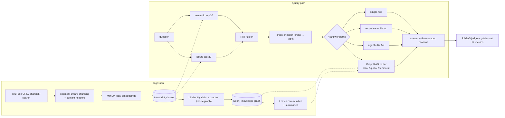

# transcript·lab — an evaluation-first RAG workbench

[](https://github.com/nmp-dsci/transcript-rag-agent/actions/workflows/ci.yml)
[](LICENSE)

A YouTube-transcript RAG system built to be **measured, not asserted**. Four
comparable answer paths run over one shared retrieval stack (hybrid BM25 + dense
fusion, cross-encoder reranking, multi-hop and agentic loops, plus a Neo4j
entity/claim graph), and every claim about retrieval quality is backed by a
committed, reproducible eval run.

> **Licence:** MIT (`LICENSE`). **CI:** lint · type-check · tests · a deterministic
> eval-regression gate — see `.github/workflows/ci.yml`. Copy `.env.example` to
> `~/.env` to configure keys.

## The thesis

Full-transcript prompting is the quality baseline but burns tokens; RAG cuts the
cost but only if retrieval actually surfaces the right evidence. The interesting
question is not "does RAG work" but **"which retrieval configuration ranks the
evidence best, and how do you know?"** — so this repo treats retrieval as an
experiment with a golden set, IR metrics, an ablation harness, and a CI gate,
rather than a setting you tune by vibes.

## Architecture



## Results: which retrieval actually wins?

`eval-ablation --sweep extended` sweeps eight retrieval configurations over the
same 20 labelled golden questions and reports rank-aware IR metrics. No answer
is generated and no judge runs, so every number here is deterministic id
arithmetic (`evals/runs/ablation-*.json`; it renders live in the workbench
**Experiments** tab):

| config | recall@1 | recall@3 | recall@5 | recall@10 | MRR | NDCG@10 | video_recall |
|--------|:-------:|:-------:|:-------:|:--------:|:---:|:------:|:-----------:|
| semantic (baseline) | 0.101 | 0.312 | 0.452 | 0.618 | 0.661 | 0.535 | 0.941 |
| semantic+rerank *(shipped default)* | 0.128 | **0.371** | **0.503** | 0.626 | 0.713 | 0.571 | 0.941 |
| **hybrid** | 0.134 | 0.359 | 0.468 | **0.667** | **0.741** | **0.585** | 0.941 |
| hybrid+rerank | 0.110 | **0.371** | 0.486 | 0.607 | 0.662 | 0.545 | 0.941 |
| HyDE | **0.149** | 0.320 | 0.423 | 0.591 | 0.669 | 0.525 | 0.917 |
| multi-query | 0.107 | 0.291 | 0.404 | 0.635 | 0.601 | 0.515 | 0.941 |
| contextual | 0.143 | 0.315 | 0.389 | 0.545 | 0.707 | 0.516 | 0.941 |
| contextual+hybrid+rerank | 0.110 | **0.371** | 0.486 | 0.625 | 0.663 | 0.555 | **0.964** |

The honest finding: **plain hybrid fusion still wins on the headline ranking
metrics** — no variant beats it on recall@10, MRR or NDCG. Each of the others
bought something narrower, and paid for it somewhere else:

- **Hybrid** improves everything at once — recall@10 +0.05, MRR +0.08, NDCG
  +0.05 over plain semantic — by recovering the exact terms (figures, scheme
  names, dates) that embeddings blur.
- **The cross-encoder helps a bi-encoder ranking and hurts a fused one.** The
  sweep is ordered as two pairs that differ *only* by reranking, and they
  disagree:

  | | recall@3 | recall@5 | recall@10 | MRR | NDCG@10 |
  |---|:---:|:---:|:---:|:---:|:---:|
  | semantic → +rerank | **+0.058** | **+0.052** | +0.008 | **+0.052** | **+0.036** |
  | hybrid → +rerank | +0.012 | +0.018 | **−0.061** | **−0.079** | **−0.040** |

  Reranking a bi-encoder ranking improves every metric, which is the textbook
  result: the bi-encoder never sees query and chunk together, so a model that
  scores the pair jointly has real signal to add. Reranking an RRF-fused
  ranking makes things worse, because fusion has *already* done that reordering
  using a second retriever's opinion, and the cross-encoder discards it —
  substituting its own judgement for an ensemble's. On this corpus the ensemble
  wins. That also makes `semantic+rerank` — what the app actually ships —
  the best config in the sweep at recall@3 and recall@5, while hybrid keeps
  deep recall and the ranking metrics.
- **HyDE has the best recall@1 of any config (+0.048)** and the worst
  `video_recall` (0.917 vs 0.941). Both come from the same mechanism: a written
  probe matches the register of a transcript sharply, and when the model invents
  the wrong specifics it retrieves confidently from the wrong video. It is a
  precision instrument with a hallucination failure mode, which is exactly what
  the theory predicts and worth being able to show.
- **Contextual retrieval** buys top-of-ranking quality (MRR +0.046, recall@1
  +0.042) and pays for it in depth (recall@10 −0.073). Situating a chunk makes
  its own topic unmistakable and makes it a worse match for questions it only
  partly covers. Stacked with hybrid+rerank it is the only config to improve
  `video_recall` at all (0.964), i.e. the only one that found a source video the
  others missed entirely.
- **Multi-query** widens slightly (recall@10 +0.017) and blurs the ranking
  (MRR −0.059) — more phrasings mean more ways to be roughly right.

`video_recall` near 1.0 everywhere says the corpus almost always contains the
right source video, so the open problem is chunk-level *ranking*, not finding
the source. That is the segment-level, defensible conclusion the eval harness
exists to produce — including the conclusion that a technique did not help.

## Quickstart

```bash
uv sync                                          # Python deps
cp .env.example ~/.env                           # then fill in your API keys
cd frontend && npm install && npm run build && cd ..   # build the React UI
uv run python -m src.cli serve                   # http://127.0.0.1:8000
```

Then measure retrieval and validate everything:

```bash
uv run python -m src.cli eval-ablation                    # retrieval science (free, deterministic)
uv run python -m src.cli index-contextual                 # build the Contextual Retrieval index
uv run python -m src.cli index-themes                     # build the cross-video theme layer (RAPTOR level 2)
uv run python -m src.cli index-conflicts                   # build the disagreement layer (where the corpus contradicts itself)
uv run python -m src.cli eval-ablation --sweep extended   # + HyDE / multi-query / contextual columns
uv run python -m src.cli eval-critique                    # held-out expert: criteria recall + provenance
uv run pytest -q                                          # 700+ Python tests
cd frontend && npm test                                   # frontend tests
```

## What's inside

- **Retrieval:** segment-aware chunking, local dense embeddings (Chroma), BM25,
  RRF hybrid fusion that *widens* recall, cross-encoder reranking, contextual
  headers, neighbour expansion, channel/video scoping.
- **Retrieval variants:** HyDE and multi-query fan-out on the query side (both
  cached per question, so a sweep is reproducible and free to repeat), and
  Anthropic-style Contextual Retrieval on the index side — a parallel collection
  whose chunks are embedded with an LLM-written situating sentence. Each is a
  column in the ablation and a row in the head-to-head matrix.
- **Answer paths:** full-transcript baseline, single-hop RAG, recursive multi-hop
  RAG, a LangGraph ReAct agent, and a GraphRAG agent over a Neo4j entity/claim
  knowledge graph — all comparable side by side.
- **Document review in the chat:** a URL in a message is fetched behind SSRF
  guards, extracted into sections, and reviewed against the corpus — your
  document supplies what is critiqued, the transcripts supply the criteria, and
  the two are cited separately.
- **GraphRAG (P4):** per-chunk LLM entity/claim extraction (cached by chunk
  hash), Leiden communities with up-front summaries, and a router that answers
  local questions with subgraph + vector evidence, global questions over
  community summaries, and temporal questions as dated claim timelines.
- **Evaluation:** a RAGAS judge that derives each score from its own persisted
  intermediates, a second `depth-v2` rubric that weights grounding at 40% against
  five LLM-judged depth metrics at 60% (with a hard cap when faithfulness is
  low), a golden set with chunk-level labels plus global/temporal
  question types, deterministic IR metrics (`recall@k`, `MRR`, `NDCG`), an
  ablation harness, a head-to-head engine matrix (`eval-matrix`), rubric
  re-scoring of a committed run without re-running it (`rejudge`), an
  extraction-quality check, independent (non-DeepSeek) judging, and committed
  run snapshots gated in CI.

---

The rest of this document is the detailed command and internals reference.

## YouTube Transcript RAG Demo

CLI prototype that demonstrates the value of RAG over full-transcript prompting for YouTube transcript Q&A.

The main demo compares one question across three transcript input types:

- `raw_single`: full raw transcript for one video.
- `rag_single`: top 10 retrieved chunks for that same video.
- `rag_all`: top 10 retrieved chunks across all indexed videos.

The demo writes `dashboard/evaluation.html`: one question answered three ways — `rag_llm` single-hop, `rag_llm` recursive, and the agentic `rag_agent` — laid out as three side-by-side columns in dark mode, each titled by its command with the full command in an expandable block.

### Setup

This project uses `uv`.

```bash
uv sync
```

The dashboard Chunk Space tab uses `scikit-learn` for deterministic PCA projection of stored chunk embeddings; it is installed by `uv sync`.

Create `~/.env` (the tracked `.env.example` is a ready-to-fill template):

```text
SUPADATA_API_KEY=<Supadata API key>
# SUPERDATA_API_KEY is also supported for compatibility with earlier project wording.
DEEPSEEK_API_KEY=<DeepSeek API key>
DEEPSEEK_MODEL=deepseek-v4-flash
DEEPSEEK_BASE_URL=https://api.deepseek.com
YT_AGENT_CHROMA_PATH=.yt-agent/chroma
YT_AGENT_RAW_TRANSCRIPT_COLLECTION=raw_transcripts
YT_AGENT_CHUNK_COLLECTION=transcript_chunks
YT_AGENT_TRANSCRIPT_SUMMARY_COLLECTION=transcript_summaries
YT_AGENT_EMBEDDING_MODEL=sentence-transformers/all-MiniLM-L6-v2
YT_AGENT_EMBEDDING_DEVICE=cpu
YT_AGENT_RAG_TOP_K=10
YT_AGENT_TRANSCRIPT_FILTER_TOP_K=5
YT_AGENT_TRANSCRIPT_FILTER_MIN_SCORE=0.25
YT_AGENT_RAG_RECURSIVE_DEFAULT=false
YT_AGENT_RAG_MAX_DEPTH=1
YT_AGENT_RAG_MAX_FOLLOWUPS=3
YT_AGENT_RAG_FOLLOWUP_TOP_K=
YT_AGENT_RAG_NOVELTY_MIN_CHUNKS=2
YT_AGENT_RAG_MAX_TOTAL_FOLLOWUPS=
YT_AGENT_RAG_AGENT_MAX_ITERATIONS=10
YT_AGENT_CHUNK_TARGET_CHARS=1200
YT_AGENT_CHUNK_OVERLAP_CHARS=150
NEO4J_URI=bolt://localhost:7687
NEO4J_USER=neo4j
NEO4J_PASSWORD=yt-agent-graph
YT_AGENT_GRAPH_CACHE_PATH=.yt-agent/graph_cache
YT_AGENT_RETRIEVAL_MODE=semantic
YT_AGENT_RETRIEVAL_CANDIDATES=30
YT_AGENT_RERANK_ENABLED=true
YT_AGENT_RERANK_MODEL=cross-encoder/ms-marco-MiniLM-L-6-v2
YT_AGENT_NEIGHBOR_SPAN=0
YT_AGENT_QUERY_TRANSFORM=none
YT_AGENT_MULTI_QUERY_VARIANTS=3
YT_AGENT_QUERY_CACHE_PATH=.yt-agent/query_cache
YT_AGENT_CONTEXTUAL_CHUNK_COLLECTION=transcript_chunks_contextual
YT_AGENT_CONTEXT_CACHE_PATH=.yt-agent/context_cache
YT_AGENT_LLM_TIMEOUT_SECONDS=120
YT_AGENT_JUDGE_SAMPLES=1
YT_AGENT_DISCOVERY_CACHE_TTL_HOURS=24
SUPADATA_TIMEOUT_SECONDS=120
SUPADATA_POLL_INTERVAL_SECONDS=2
SUPADATA_MAX_POLL_SECONDS=600
MLFLOW_TRACKING_URI=file:.yt-agent/mlruns
MLFLOW_EXPERIMENT_NAME=yt-agent-v1
YT_AGENT_LOG_TRANSCRIPT_ARTIFACTS=false
```

`SUPADATA_API_KEY` is used with the Supadata transcript API. DeepSeek is called through the OpenAI-compatible LangChain client.

`YT_AGENT_EMBEDDING_DEVICE` pins the torch device for the embedding model and
defaults to `cpu`. Left to its own devices, sentence-transformers selects MPS on
Apple Silicon, where the first embed call never returns — it wedges inside the
Metal driver, and under `serve` that hangs the whole process with the port still
bound and the PID unkillable (`STAT UE`). Set `mps` or `cuda` to opt back into a
GPU where one actually works.

### Retrieval strategy

`YT_AGENT_RETRIEVAL_MODE` selects how chunks are found:

- `semantic` (default) — embed the question, cosine-rank chunk embeddings.
- `hybrid` — rank semantically *and* with BM25, then fuse the two rankings with
  Reciprocal Rank Fusion. Keyword and embedding retrieval disagree most on exact
  terms (figures, names, dates), which is what fusion recovers.

Both modes pull `YT_AGENT_RETRIEVAL_CANDIDATES` chunks before narrowing to
`top_k`, because reranking can only reorder what it was given. Reranking those
candidates with a local cross-encoder (`YT_AGENT_RERANK_MODEL`) is **on by
default**; it loads lazily on first use and adds no API calls. Set
`YT_AGENT_RERANK_ENABLED=false` to retrieve without it — the `eval-ablation`
harness (below) quantifies its effect, and the effect depends on what it is
reranking. On the default semantic mode it improves every metric (recall@3
+0.058, recall@5 +0.052, MRR +0.052), which is why it ships on. On top of
hybrid fusion it is a net loss (recall@10 −0.061, MRR −0.079), because RRF has
already reordered using a second retriever and the cross-encoder replaces that
ensemble judgement with its own.
`YT_AGENT_NEIGHBOR_SPAN=1` pastes the chunks either side of each hit into the
context, which stops answers being cut off mid-sentence at a chunk boundary. Per-request overrides come from the workbench's ⚙ advanced panel, so a
setup can be compared under both modes with the same judge.

Retrieval can be scoped to a **channel** or a **single video**. Channel
filtering is a native metadata filter, which is why chunks carry
`channel_id`/`channel_name`. Chunks indexed before that existed need a one-off
backfill:

```bash
uv run python scripts/backfill_chunk_metadata.py --dry-run   # report only
uv run python scripts/backfill_chunk_metadata.py             # stamp metadata
uv run python scripts/backfill_chunk_metadata.py --re-embed  # + contextual headers
```

The plain form only rewrites metadata and never re-embeds. `--re-embed` also
rebuilds every chunk vector with a contextual header (`[channel — title @
mm:ss-mm:ss]`) prepended before embedding. Transcript chunks are conversational
fragments that frequently lose their subject ("had. So, I'm going to just
copy…"), and the header restores the context the speaker left implicit; the
header is embedded but is not part of the text shown to the answering LLM.

**Stored citations written before references were reconciled** carry a
`chunk_index` the answering LLM invented. The model never sees a chunk index —
the context header shows `video=<id>`, a `mm:ss` window and a timestamp URL — so
it wrote down the only number it could see, the citation label, and the field
meant "the third chunk of this answer" while claiming to mean "chunk 3 of this
video". Both live paths reconcile against real chunks now; this repairs the
history they were fixed too late for:

```bash
PYTHONPATH=. uv run python scripts/backfill_reference_chunk_index.py --check
PYTHONPATH=. uv run python scripts/backfill_reference_chunk_index.py --apply
```

It re-resolves each citation by `(video_id, start_seconds)` against the live
chunk store — the same rule the agentic path uses at answer time, and it works
because `start_seconds` was copied or derived from what the model was *shown*.
A citation that does not resolve within two seconds is left alone and reported,
not snapped to the nearest chunk. Three things make the result checkable:
`--check` reports zero wrong after a successful `--apply` and stays zero
(the operation is idempotent); the writer refuses to save if any value other
than a `chunk_index` inside a `references` list differs from what it loaded; and
every reference with a positional label is cross-checked against
`retrieved_chunk_ids[n-1]`, a route that shares no input with the timestamps, so
a disagreement aborts the write rather than being resolved by guess.

Supadata can return async jobs for longer videos. `SUPADATA_MAX_POLL_SECONDS=600` lets indexing wait up to 10 minutes for those jobs before timing out.

Recursion env vars are used only when recursive mode is effectively on via `--recursive` or `YT_AGENT_RAG_RECURSIVE_DEFAULT=true`. Empty `YT_AGENT_RAG_FOLLOWUP_TOP_K` defaults follow-up retrieval to `YT_AGENT_RAG_TOP_K`; empty `YT_AGENT_RAG_MAX_TOTAL_FOLLOWUPS` defaults to `max_depth * max_followups`.

`YT_AGENT_RAG_AGENT_MAX_ITERATIONS` (default `10`) is read only when the agentic RAG agent is used via `rag-ask --rag_agent`. It is the hard cap on the LangGraph ReAct loop and can be overridden per-run with `--max-iterations`. It has no effect on any other path.

### Retrieval variants: HyDE, multi-query, contextual retrieval

Three further techniques change *what gets matched* rather than how the answer
is written. Each is measurable on its own, which is the point of having them:
they are columns in `eval-ablation --sweep extended` and rows in the Scoreboard,
not options you have to take on faith.

**Query-side — `--query-transform`.** The user's question and the passage that
answers it are written in different registers, and one embedding of the question
has to bridge that on its own.

- `hyde` — the model writes the passage that *would* answer the question, and
  retrieval embeds that instead. The passage may be factually wrong; it is never
  shown to anyone and never enters the answer, but it is written in the
  vocabulary of the corpus, which is what the vector search matches on.
- `multi_query` — the model paraphrases the question
  `YT_AGENT_MULTI_QUERY_VARIANTS` ways (default 3), each phrasing retrieves
  independently, and the rankings are RRF-fused. The original question is always
  the first query, so this can only add to what the plain search already found.

Both cache their expansion per question under `.yt-agent/query_cache`, so
re-running a sweep costs nothing and returns the identical retrieval. A failed
expansion degrades to the question as asked and says so in the answer trace.
They affect the vector search only — BM25 fusion keeps matching the question the
user typed, since keyword-matching a hypothetical passage searches for words
nobody wrote.

**Index-side — `index-contextual`.** Anthropic's Contextual Retrieval: one LLM
call per chunk writes the sentence that says what the chunk is about within its
video, using the surrounding transcript as evidence. That sentence joins the
deterministic header (`[channel — title @ mm:ss-mm:ss]`) the chunker already
writes — the two answer different questions, *which video* versus *what about
it*.

```bash
uv run python -m src.cli index-contextual        # ~1 LLM call per chunk, cached by chunk hash
uv run python -m src.cli rag-ask "..." --rag_llm --contextual
```

Three boundaries make this a measurement rather than a rewrite:

- It writes a **parallel collection** (`transcript_chunks_contextual`), so the
  baseline index survives to be compared against.
- **Only the embedding changes.** The situating sentence is embedded and stored
  as metadata; the answering LLM still receives the spoken text alone, so a win
  is a retrieval win with generation held fixed.
- **Cached by chunk hash**, like graph extraction, so a re-run only pays for
  chunks whose text changed, and a failed chunk retries rather than being pinned.

**Corpus-side — `--filter-transcripts`.** Route the question to whole *videos*
before any chunk is searched: each video's LLM-written summary is embedded, the
question is matched against those summaries, and only the videos above
`YT_AGENT_TRANSCRIPT_FILTER_MIN_SCORE` (default 0.25, top
`YT_AGENT_TRANSCRIPT_FILTER_TOP_K` = 5) have their chunks searched at all. The
answer trace records which videos matched and with what score, so the routing
decision is checkable rather than implicit.

```bash
uv run python -m src.cli rag-ask "..." --rag_llm --filter-transcripts
```

**The cap does not apply to a corpus-wide question.** `TOP_K` is a *budget*;
`MIN_SCORE` is the relevance test. "What are the main themes across this
corpus?" has no top five — the answer is the spread, and capping at five gives
a confident answer about a fifth of the evidence. `src/rag/question_scope.py`
detects corpus-wide phrasing with a deterministic lexical rule (no LLM on the
retrieval hot path) and lifts the cap to the number of summarised videos,
keeping `MIN_SCORE` doing the filtering. The trace records a `route` step naming
the signal that fired, e.g. `matched 'corpus' — summary filter cap raised from
5 to 68`. A false positive only removes a cap, so a specific question misread as
corpus-wide degrades *towards* the unfiltered baseline rather than towards
nonsense. Pass `corpus_wide_filter=False` to `MultiTranscriptRagContextProvider`
to reproduce the pre-change behaviour for a controlled comparison.

**Lifting the video cap makes breadth possible, not certain — and the second
half is off by default.** Retrieval still returns `top_k` *chunks*, so an answer
draws on at most `top_k` videos however many the filter admits. On
`matrix-20260811-023531` (71 videos, 1792 chunks) the six corpus-wide golden
questions went from 3.33 to 4.50 distinct videos per answer when the cap was
lifted — still below the 5.00 of the unfiltered `rag_llm` baseline, with three
of the six unmoved. `corpus_wide_max_per_video=N` on
`MultiTranscriptRagContextProvider` caps how many chunks one video may
contribute to the final `top_k` on a corpus-wide question: chunks the cap passes
over are parked and backfilled if the selection would otherwise come up short,
so every chunk that reaches the answer was still ranked by retrieval and the
ranking order is preserved. It ships **off** (`0`), because a breadth gain
bought by retrieving worse chunks is not a gain, and only the matrix can tell
the two apart — read `source_breadth` (distinct videos per answer, computed from
chunk ids with no model calls) next to `faithfulness` and `context_precision` on
the same cells. The trace records a `Source diversity` step naming the cap, the
videos kept, and the videos in the pool.

**Both switches are part of the eval cache's identity.** Neither is a `Settings`
field, so neither moves anything `cell_fingerprint` reads — the same class of
defect as comparing a 38-video corpus against a 53-video one.
`src/rag/question_scope.py` therefore declares the corpus-wide behaviours by
name (`capped` → `budget` → `budget+diversity`) and a provider derives its own
from its switches, so a matrix run scored under one behaviour can never be
handed back for a run of another. The name enters the fingerprint only for the
cells it can reach — a summary-filtered setup asked a corpus-wide question — so
adding it invalidated six cells of a forty-cell run rather than all forty, and
`capped` is omitted entirely so the pre-change arm of an A/B comes back from the
cache for free. An unregistered name raises rather than hashing. The name is
also recorded in every run's `config` block as `retrieval_behavior`.

**It is not redundant with the reranker, and the trace proves which one does
what.** Every retrieval step records its 30-candidate pool before reranking, so
the two stages can be counted separately:

| question | off-genre chunks in the pool | kept by the reranker | kept after routing |
|---|---|---|---|
| "how should I prepare for behavioural interview questions?" | 8 system-design | **3 of 8** | **0** (none reach the pool) |
| "…my investment and portfolio experience in an interview?" | 3 property | **1 of 3** | **0** |

Two things follow. On ordinary career questions no property chunk enters the
pool at all — property and career sit far apart in embedding space, so
first-stage search never surfaces one and *nothing* has to remove it. But when
an off-genre chunk is a **near neighbour** — "interview" meaning a system-design
interview, "portfolio" meaning a property portfolio — the reranker keeps it,
because lexically it really is on topic. Routing is the only stage that
excludes it, and near neighbours are exactly where the reranker is weakest.

All three are registered as setups — `rag_llm_hyde`, `rag_llm_contextual` and
`rag_llm_filtered` — which answer identically to `rag_llm` and differ only in
the retrieval they read. That is what lets `eval-matrix` and the Scoreboard
attribute a score gap to retrieval alone. `rag_llm_filtered` in particular
shares the baseline's provider, index and models outright: the only difference
is the set of videos that provider is allowed to search.

### Reviewing a document you share

Paste a URL into a chat message and the answer becomes a review of that page.
There is no mode to switch and no second tab — a message without a URL behaves
exactly as it always has, and a YouTube link keeps its existing meaning (it
scopes retrieval to that video).

```text
any feedback on https://example.com/my-cv ?
```

The page is fetched, extracted into sections, rendered as a card above the
answer, and answered over **both** the document and the transcript corpus. The
two are cited differently on purpose: `[§3]` points at a section of *your*
document, `[7]` at a transcript chunk that supplies the recommendation. So the
answer can say "your §3 opens with 'responsible for' — [7] argues for leading
with the outcome" and both halves are checkable.

What the design commits to, and why:

- **Extracted text, not the live page.** An iframe is refused by most real
  sites via `X-Frame-Options`/CSP and a screenshot needs a headless browser —
  but the deciding reason is that extracted text is what the model actually
  reads, so it is what you should be able to inspect.
- **Only the single-hop path answers a review.** The agentic and graph paths
  build their own requests and would ignore the document, producing a corpus
  answer dressed as a review.
- **Follow-ups reuse the document.** Asking "now check the experience section"
  in the same thread re-reads the stored text rather than re-fetching, so a
  conversation about one document cannot quietly become about two.
- **The fetched text never enters `chat_history.json`.** That file is
  committed; the document lives under gitignored `.yt-agent/documents/` and the
  history holds only its id, plus two facts *about* the read (`document_detail`,
  `document_sections_selected`). Clearing the store loses the cards, not the
  conversation.

  **Know the limit of that split.** It keeps the *extraction* out of the tracked
  file — not every trace of the document. The answer quotes the phrases it
  critiques, and the question contains the URL, so both land in
  `chat_history.json` and in `dashboard/chat.html`. That is fine for a public
  portfolio and is the point for a demo. For the private resume this feature is
  pitched at, quoted lines of your employment history would be committed along
  with the review. If that matters to you, review private documents in a
  checkout you do not commit, or delete the entry before committing —
  `create_app(history_path=...)` and `run_session(history_path=...)` both take a
  path outside the repo, though no CLI flag exposes it yet.
- **The card always states how much was read.** Every review card carries a
  selection line — `whole document — all 9 sections in context`, or the narrowed
  equivalent — and the entry records it alongside the document id, so a reopened
  conversation reports what that answer actually saw rather than re-deriving it.
  A page over the fetch cap, or a document too long for the context budget, says
  so in the card *and* in the model's own context: a review of 6 of 40 sections
  must not read as a review of the document.
- **The URL is not what the corpus is searched with.** A URL matches no
  transcript and dilutes the words that would, so it is stripped from the
  retrieval query while the answering prompt keeps your original wording.
- **A document with no question is retrieved on its *kind*, not its subject.**
  `review this: <url>` leaves nothing to search on, and it is the shortest thing
  anyone can type, so this path decides whether the feature works. The obvious
  fallback — search for what the document is about — is wrong and measurably so.
  A portfolio's headings are its project names, so it retrieved transcripts
  about building those projects: **0 of the top 30 chunks were about hiring or
  portfolios**, and the review was grounded in criteria that had nothing to do
  with reviewing anything.

  So `classify_document()` names the kind (`resume`, `portfolio`, `profile`,
  `cover_letter`, else `document`) from the title, headings and host, and
  `REVIEW_INTENT_QUERIES` turns that into the criteria query for that kind —
  "how to present engineering projects on a personal portfolio site so
  recruiters take them seriously…". Same page, same three words typed: **29 of
  the top 30 chunks are now hiring/portfolio material.** Subject matter answers
  "what is this document"; a review needs "what should this be judged against",
  and those have different answers.

  Classification reads what a document *calls itself*, never what it mentions —
  headings and title for resume signals, opening and sign-off for a cover
  letter — so a blog post about resumes is not a resume and a portfolio quoting
  "Sincerely, Priya" is not a cover letter.
- **An unrecognised kind says so.** Every kind above is a career document,
  because that is what the corpus holds. A wedding invitation still retrieves
  ten chunks — they are simply the closest career advice in the store. So
  `corpus_coverage_warning()` fires for kind `document`, and it lands in three
  places: the first step of the trace (`route · Corpus coverage`), the model's
  own context, and a prompt rule requiring the answer to open with it and to
  flag per-point when a citation is the nearest thing rather than a real
  criterion. Reviewing an invitation half against resume advice is fine; doing
  it silently is not.
- **The answering prompt changes with the subject.** A review runs
  `DOC_REVIEW_SYSTEM_PROMPT` *and* `DOC_REVIEW_USER_PROMPT` (both on the Prompts
  tab). The ordinary RAG user template tells the model to answer "using only the
  retrieved transcript chunks", which is the wrong instruction when the subject
  is your document; the review template instead asks for every point to be
  grounded twice — a `[§N]` naming the section and a `[N]` for the corpus
  recommendation that makes it worth changing.

Fetching a user-supplied URL is a server-side request forgery primitive, so
`src/documents/fetch.py` bounds it on five axes: `http(s)` only, every resolved
address must be globally routable, redirects are followed manually with the
same address check on each hop, the body is streamed under a byte cap, and only
text content types are accepted. The one gap that remains — DNS rebinding
between validation and connection — is documented in that module rather than
papered over.

### Interactive Chat

The recommended entry point is the menu-driven chat. It wraps the same agents
the individual commands use, captures every question and answer, and renders a
WhatsApp-style transcript you can browse in the dashboard.

```bash
uv run python -m src.cli chat
```

#### Main menu

On launch you get a top-level menu and pick one action by typing its key:

```text
Main menu:
  [1] Ask a question
  [2] Fetch / index a new URL
  [q] Quit
Choose:
```

`q` (or `quit`/`exit`, or Ctrl-D) leaves the session. After each action the
menu reappears so you can keep going.

#### [1] Ask a question

The ask flow has three prompts:

1. **Question** — the question to ask the indexed corpus.
2. **Restrict to a single video URL** — optional. Leave blank to search every
   indexed transcript, or paste one video URL to confine retrieval to it.
3. **RAG setup(s)** — pick one setup, several (e.g. `1,3`), or `a` for all to
   answer the same question every way and compare:

   ```text
   RAG setups:
     [1] rag_llm (single-hop)        — One retrieval across all indexed transcripts, then a single LLM answer.
     [2] rag_llm (recursive)         — Multi-hop retrieval: follow-up queries fan out, then a final synthesis call.
     [3] rag_agent (agentic)         — LangGraph ReAct loop that retrieves across sub-topics until it has enough evidence.
     [4] graph_rag (knowledge graph) — Routes local/global/temporal, answers over the Neo4j entity/claim graph. Requires index-graph.
     [5] rag_llm (HyDE)              — Single-hop, but retrieval embeds an LLM-written hypothetical answer instead of the question.
     [6] rag_llm (contextual)        — Single-hop over the Contextual Retrieval index. Requires index-contextual.
     [7] rag_llm (summary-filtered)  — Single-hop, but the question is routed to whole videos by their per-video summary first.
     [a] all (compare every setup)
   Choose setup(s) (e.g. 1,3 or a; blank to cancel):
   ```

The selected setups run in order (the retrieval stack loads once, on the first
question of the session). Each answer is appended to the chat history and the
`chat.html` view is regenerated. Example session:

```text
Choose: 1
Question: Is the Gold Coast property market at risk of collapse, and why?
Restrict to a single video URL (optional, blank for all):
Choose setup(s) (e.g. 1,3 or a; blank to cancel): a
  Running rag_llm (single-hop) ...
  Running rag_llm (recursive) ...
  Running rag_agent (agentic) ...

Captured 3 answer(s) for: q-20260616-005733-5393
  - rag_llm (single-hop): 776 chars (18.44s)
  - rag_llm (recursive): 2533 chars (17.25s)
  - rag_agent (agentic): 11533 chars (34.59s)
Updated dashboard/chat.html — open it to read the conversation.
```

#### [2] Fetch / index a new URL

The fetch flow first asks whether to index a single video or a whole channel:

```text
Fetch a new URL:
  [1] Single video URL
  [2] Bulk (whole channel)
Choose:
```

- **[1] Single video URL** — prompts for one `Video URL:` and runs the same
  pipeline as `index-rag <url>`.
- **[2] Bulk (whole channel)** — prompts for a `Channel (URL or @handle):` and
  `How many latest videos? [5]:`, then runs `bulk-index channel --channel <c>
  --latest <n>`.

Both paths reuse the documented indexing commands below, so newly indexed
transcripts are immediately available to the ask flow.

#### Browsing the conversation

Each answered question is appended to `dashboard/chat_history.json` and the
`dashboard/chat.html` view is regenerated. Open it to read conversations:

```text
dashboard/chat.html
```

The left sidebar lists every question with its time and id (newest first);
clicking one loads that conversation in the main panel — your question as an
outgoing bubble, then one incoming bubble per RAG setup, each headed by the
setup name with the answer, retrieval metadata, references, and the equivalent
`rag-ask` command below it. Because the history and view regenerate after every
question, you can keep `chat.html` open and just refresh.

### Evaluation Workbench (browser)

The web app is a chat-first evaluation workbench: ask a question, read the
answer as a conversation, and have **RAGAS score every answer under the same
eval process** — faithfulness, answer relevancy, and context precision, plus a
composite — so retrieval methods are compared with numbers, not vibes.

The UI is a React 19 + TypeScript app under `frontend/`, built with Vite and
served by the same FastAPI process. It follows the OS light/dark preference by
default; the ☀/☾ toggle in the header overrides that and persists the choice
per browser.

```bash
cd frontend && npm install && npm run build && cd ..   # once, and after UI changes
uv run python -m src.cli serve                         # http://127.0.0.1:8000
uv run python -m src.cli serve --host 0.0.0.0 --port 9000
```

`frontend/dist/` is gitignored, so a fresh clone must run `npm run build`
before `serve` shows the React UI. Without a build, `/` falls back to the
legacy single-file page and `GET /api/health` reports `"ui": "legacy"` — the
API is unaffected either way.

Five views (the tab formerly called **Library** is now **RAG Pipeline**; old
`#library` and `#prompts` links still resolve):

- **Chat** — the landing tab. Type a question and it is answered in a
  conversation thread with citations back to source timestamps. The default
  agent is `rag_agent` (agentic), whose retrieval loop streams into the bubble
  live — one line per iteration showing the query it chose and how many chunks
  came back — so a ~30s research run reads as progress rather than a stall.
  Every setup — not only the agentic one — also *persists* what it did: each
  answer stores an ordered execution trace (the graph route decision, each
  retrieval/rerank/fusion stage with the chunk ids it kept, the recursive
  fan-out's per-subtopic outcomes, and every LLM call) that renders under the
  answer as a collapsed `trace — N steps` block. It is saved with the history
  entry rather than held in session state, so it survives a full reload; a run
  that errors keeps whatever it had already recorded, and steps only report
  what the code actually measured. This tab is the only place a trace renders —
  the standalone `dashboard/chat.html` viewer has no renderer for one, so the
  steps are left out of that export. Composer selects scope the question to a
  **channel** and/or a single **video** with linked dropdowns — picking a
  channel narrows the video list to it, picking a video adopts its channel,
  and a pinned video is sent alone since it is already the narrower scope.
  **⚙ advanced** exposes `top_k`, the auto-judge toggle, the smart transcript
  filter, a semantic/hybrid retrieval toggle, and additional setups to run
  alongside the default. Every answer proposes follow-up questions as
  clickable chips; asking one carries the prior question and answer as history
  so retrieval runs against a standalone rewritten query — an extra LLM call
  the trace and the bubble's LLM-call count both include — while the answering
  prompt marks that history as context only: every claim must still come from
  retrieved chunks, never from an earlier turn. When several setups answer the
  same question they share **one bubble with tabs**, each carrying its own
  answer, citations, and RAGAS score (flagged `self-graded` when the judge and
  answering model match), with the best composite badged TOP and a compare
  grid underneath. "Compare N more setups" runs the remaining ones into the
  *same* history entry so the scoreboard sees them as competing answers. Esc
  cancels a running ask.
- **RAG Pipeline** (formerly **Library**) — four sub-tabs. **Corpus &
  retrieval** opens on a summary strip of derived insights — e.g. one channel
  holding over half the corpus's chunks (skews whole-corpus retrieval toward
  it), videos with no transcript summary (invisible to the summary filter), or
  videos with no chunks at all — each clickable as a filter on the corpus tree
  below. The tree itself (all videos → channel → video → chunks) has a sort
  control for "top" ordering by views, recency, chunk count, or title.
  Expanding a video lazily loads its chunks; selecting one shows its full
  text, timestamp range, segment span, a deep link into the video at that
  moment, and — beside the chunk — the entities and dated claims GraphRAG
  extracted from it, so a reviewer can see what the graph made of a chunk
  next to the chunk itself. The **Retrieval Lab** at the top ranks the corpus
  for any query with **semantic, BM25, and/or graph side by side**; aligned
  rows show each chunk's rank in the other modes (`↑2`, `↓1`, `only here`)
  plus an overlap count, which is the fastest way to see where keyword,
  embedding, and graph retrieval disagree — a mode that cannot run (e.g. Neo4j
  unreachable) reports "unavailable" instead of failing the whole comparison.
  Indexing lives in a panel here as a **queue**: adding a video or
  channel never locks the form, so several can be queued back to back — each
  job runs to completion in submission order (one worker, so a channel run
  never contends with itself), and every job's live stage is visible in the
  queue list at once, across every open browser tab, via
  `GET /api/index/queue/stream`. A job's graph extraction stage runs
  automatically after its vector index succeeds, keeping the knowledge graph's
  entities and claims current for newly indexed videos without a manual
  `index-graph` pass; community detection and summaries are *not* rebuilt per
  job (that re-summarizes the whole graph via the LLM), so run `index-graph`
  after a batch of ingests to refresh them. Extraction failure is
  enrichment-only and is reported in that job's result without failing the
  (already-successful) vector index. **Chunk graph** renders a
  kNN similarity graph of every chunk embedding as an SVG force-style layout,
  colour-coded by channel; typing a query highlights its retrieval
  neighbourhood in place, which is the fastest way to see whether the corpus
  actually clusters around what a question is asking. **Knowledge graph**
  gives GraphRAG's Neo4j entity/claim graph the same treatment — the graph
  `graph_rag` actually reasons over is otherwise invisible from this tab, the
  same way the raw chunk-similarity plot would be without Chunk graph. Nodes
  are entities, laid out by Fruchterman-Reingold over the same weighted graph
  (RELATES + co-mention) Leiden clusters — colour-coded by community, sized
  by mention count. Clicking an entity opens its community's LLM summary,
  aliases, and every dated claim extracted about it, each linking straight to
  the source video at that timestamp — served by `GET /api/graph/knowledge`
  and `GET /api/graph/knowledge/entities/{id}`. Only up to 400 of the ~2,000
  entities render at once (by mention count), so the view supports
  wheel-to-zoom toward the cursor, drag-to-pan, double-click-to-zoom, and
  +/−/reset buttons for reaching a dense cluster or a touch/no-wheel input —
  panning past a small pixel threshold suppresses the click that would
  otherwise select the node under the pointer on release. **Themes** is
  RAPTOR level 2: clusters built over chunk embeddings from the *whole corpus
  at once*, so one theme can hold the same argument from creators who have
  never heard of each other — something the per-video summaries one level down
  cannot produce, because their unit is the video. Each theme lists the videos
  and creators it spans, then its member chunks grouped by video; clicking a
  member opens its transcript text and a deep link into that video at the
  timestamp. Themes that span two or more videos sort first and a single-video
  theme is labelled as such rather than hidden — that is precisely the case
  where this layer adds nothing over level 1. Built by `index-themes` and
  served by `GET /api/themes` and `GET /api/themes/{theme_id}`.
  **Disagreements** is the layer that refuses to blend: pairs of claims from
  different creators about the same subject, each put to one test — *could one
  person hold both of these views?* — and only the ones where they could not are
  here. Each card is an axis stated as a question and two sides in equal
  columns, with each side's verbatim quote cut from the stored transcript and a
  deep link to the second it was said. There is no winner anywhere, in the
  layout or in the payload. The header carries the count *with its denominator*
  (7 disagreements out of 710 candidate pairs, each looked at 9 times) and the
  calibration probes, because a conflict count is only worth reading beside
  evidence that the adjudicator which produced it could still say
  "complementary" that day. Every card also carries its own vote — "agreed 3/3
  looks" or "split — only 2 of 3 looks" — because the judge does not agree with
  itself and those are different claims; and a factual contradiction is labelled
  as one rather than dressed as a matter of taste.
  Built by `index-conflicts` and served by `GET /api/conflicts`.
- **Scoreboard** — the leaderboard for one **committed matrix run**: every setup
  answering the *same* golden questions under one recorded config, graded by one
  judge. A run picker selects which committed `matrix-*.json` to rank (newest by
  default), so an older run stays available for comparison; each option is
  labelled with the **rubric** that composited it (`ragas-v1` or `depth-v2`),
  because two runs over identical answers can rank the setups differently purely
  by rubric. Rows are groupable by
  **setup × answering model** so scores from different model versions are never
  silently averaged, and each shows average score per metric of the run's rubric,
  composite, win rate, latency, and token estimate — plus `capped` / `ungrounded`
  badges where the rubric's faithfulness cap decided a row's answers or its
  grounding floor was breached. A **self-graded** warning sits above the table
  whenever the answering model also judged, and a coverage note states any cells
  the rubric could not score. A **Rubric** panel
  underneath turns the table on its side: one row per metric with the weight it
  carries, banded into `grounding (40%)` and `depth (60%)` under `depth-v2`, or
  three ungrouped rows under `ragas-v1`. Expanding a cell in the **Answers**
  panel shows the cap reason and the judge's one-sentence rationale per depth
  metric as readable text. See [4d](#4d-rejudging-a-run-under-a-different-rubric-depth-v2)
  for the rubric itself. An **efficiency panel** ranks setups
  by composite score per 1k tokens, so a setup spending more to score lower is
  visible rather than merely "slower". A judge filter keeps self-graded and
  independently-graded runs apart, and a provenance bar states the judge model,
  ragas version, embedding model, metric definitions, and last-judged time.
  Underneath, a collapsed **Questions** panel opens the averages back up: one
  row per golden question in the selected run — its text, domain, and question
  type — with every setup's composite *on that question*, so a leading average
  is traceable to the questions that produced it rather than taken on trust. A
  cell the judge never scored reads `unjudged` (a run committed with
  `--no-judge` has questions but no scores) and one whose engine failed reads
  `error` with the message on hover, so a blank is never mistaken for a zero.

  This tab reads the **eval** set, not the live one. Chat and its history stay
  exploratory — ask anything, judge it, keep it — but they no longer decide the
  ranking, because whichever questions happened to be asked would otherwise
  determine which engine "won", and a newly added engine stayed invisible until
  someone manually re-asked every question through it.
- **Experiments** — the committed retrieval science, and where you start a run.
  **Run eval matrix** kicks off a judged head-to-head in the background with live
  per-cell progress (`POST /api/eval/matrix` + an SSE feed), committing a new
  `matrix-*.json` the Scoreboard can then rank; cells already scored under the
  same configuration are reused, so re-running after adding one question only
  pays for what changed. The **head-to-head matrix** table renders first: every
  RAG engine — including `graph_rag` — against the same golden questions, scored
  by the same RAGAS + reference metrics, with a question-type switcher
  (overall / local / global / temporal) and per-engine latency and context-token
  columns, so "GraphRAG wins temporal, ties local, costs more" is a number
  instead of a claim. Below it, the `eval-ablation` sweeps across `recall@k`,
  `MRR` and `NDCG` — semantic vs hybrid vs hybrid+rerank, plus the HyDE,
  multi-query and contextual-retrieval columns when the run was an extended
  sweep (each run is labelled with the sweep that produced it) — with the best
  value per metric highlighted, deltas versus the semantic baseline, and a
  per-domain toggle; then the end-to-end golden runs with their retrieval
  config, judge model, and headline scores. Everything shown is reproducible from a snapshot
  in the repo — served by `GET /api/experiments`.
- **System Design** — how the app is actually built, as a click-through graph
  rather than a document that drifts from the code. Left column: every answer
  path (`chat`, `vector_rag`, `recursive_rag`, `agentic_rag`, `graph_rag`, plus
  the `hyde_rag` and `contextual_rag` retrieval variants), the summary-filter
  stage, the shared models (DeepSeek, the embedding model, the reranker), and
  the stores each depends on (the four Chroma collections, Neo4j) laid out as a
  node graph. Click any node to open its detail panel:
  the exact system prompts it runs (highlighted `{template_vars}`, one-click
  copy) and its live configuration — `top_k`, retrieval mode, Neo4j URI,
  chunking parameters, whatever applies to that node — read straight off the
  running `Settings` instance via `GET /api/system-design`, so the view can
  never show a prompt or a setting the server isn't actually using. Every
  answer path also carries **how a question flows through this path**: the
  ordered, numbered steps it actually runs, with the live values interpolated
  the same way the config table is — retrieval breadth and `top_k`, the rerank
  model, the follow-up and novelty caps, the ReAct iteration cap, the graph
  evidence caps — so a step can never describe behaviour the settings have
  since changed. `graph_rag`'s flow is grouped by route, which is where the
  three answer differently: the **local** route retrieves entity claims *and*
  the same vector chunks `vector_rag` would, **global** reads the pre-built
  community summaries instead, **temporal** reads the dated claim timeline,
  and all three converge on one answer call.

#### Frontend development

```bash
cd frontend
npm install
npm run dev        # Vite on :5173, proxies /api to uvicorn on :8000
npm test           # Vitest
npm run typecheck  # tsc --noEmit (strict)
npm run build      # emits frontend/dist for `serve`
```

Run `uv run python -m src.cli serve` in a second terminal while using
`npm run dev`; the dev server proxies `/api` to it and passes SSE straight
through. Restart `serve` after the first `npm run build` so it picks up the
newly created `frontend/dist`.

Retrieved chunk texts are persisted with each answer (`contexts` in the
history JSON) so judging can run at any time, including re-judging with
`force`. Questions asked in the browser are appended to the same
`dashboard/chat_history.json` and regenerate `dashboard/chat.html`, so the CLI
chat, the workbench, and the static viewer share one history. Entries recorded
before context persistence report "no stored retrieval contexts" instead of
scores.

Each answer also records the stack that produced it — `model`,
`embedding_model`, and the effective `top_k` — and each evaluation records
`ragas_version` and the judge's `embedding_model`. All of these default to
`null`, so histories written before they existed keep loading unchanged; the
scoreboard reports those rows as `— pre-provenance` rather than attributing
them to a model.

Every answer also carries `trace`: the ordered steps its path actually ran,
each with a `phase` (`route`, `filter`, `retrieve`, `rerank`, `merge`, `llm`),
a `label`, a `detail`, the `chunk_ids` that step kept, and — where the code
measured them — `model`, `elapsed_ms`, and `iteration`. It is written by the
setup runner, so CLI-captured answers are traced too; an empty `chunk_ids` or a
null `elapsed_ms` means that step was not measured rather than measured as
zero. The one gap is `rag_agent`'s per-iteration steps, which come from the
streamed `agent_step` events and so exist only for browser asks — the CLI and
eval paths record a single summary step with the iteration count instead.
`trace` defaults to `[]`, so entries written before tracing load unchanged and
simply render no trace block.

Endpoints (JSON unless noted):

| Endpoint | Method | Purpose |
|----------|--------|---------|
| `/` | GET | The workbench UI (React bundle, else the legacy page) |
| `/api/health` | GET | Liveness, lazy-stack state, judge/answer/embedding models, `ui` mode |
| `/api/setups` | GET | The RAG setup descriptors |
| `/api/experiments` | GET | Committed ablation, golden-run and matrix snapshots for the Experiments tab |
| `/api/prompts` | GET | The live prompt registry, grouped by system |
| `/api/system-design` | GET | The System Design graph: nodes, edges, and each node's prompts, live config, and (for answer paths) its `flow` steps |
| `/api/history` | GET | All captured conversations (with evaluations) — the live set |
| `/api/corpus` | GET | Indexed videos with metadata, chunk counts, and derived corpus insights |
| `/api/corpus/{video_id}/chunks` | GET | Stored chunks for one video, ordered by index |
| `/api/scoreboard` | GET | Leaderboard for one committed matrix run — aggregated `setups` rows plus the run's per-question rows (`questions`, each setup's composite on each golden question); `run_id` picks the run, `group_by=setup\|setup_model`, `judge_model` filter |
| `/api/eval/matrix` | GET/POST | The current matrix run; POST starts one (returns the run already in flight, if any; 422 on an unknown setup) |
| `/api/eval/matrix/stream` | GET | Live per-cell progress for the running matrix (SSE, seeded with current state) |
| `/api/ask` | POST | Answer a question (streams SSE; `entry_id` appends to an existing entry, `document_entry_id` re-reads a prior entry's pinned document for a follow-up) |
| `/api/documents/{document_id}` | GET | One reviewed document, read from the gitignored document store (404 if cleared) — how a document card re-renders after a reload |
| `/api/rank` | POST | Rank the corpus for a query by `semantic`, `bm25` and/or `graph` (a mode that cannot run is reported in `errors` and left out of `overlap`, rather than failing the request) |
| `/api/judge` | POST | RAGAS-score an entry's answers (streams SSE; `force` re-judges) |
| `/api/index` | POST | Index a video (`mode=video`) or channel (`mode=channel`) |
| `/api/index/stream` | POST | Index with per-stage SSE progress and a summary of what changed |
| `/api/index/queue` | POST | Queue an index job and return immediately; jobs run one at a time in submission order |
| `/api/index/queue` | GET | Snapshot of every queued, running and finished job |
| `/api/index/queue/stream` | GET | Live progress for every job at once (SSE, seeded with the current queue) |
| `/api/chunk-graph` | POST | kNN similarity graph over chunk embeddings; `query` highlights its retrieval neighbourhood |
| `/api/graph/knowledge` | GET | The GraphRAG entity graph: laid-out entity nodes, relation/co-mention edges, community summaries (503 if Neo4j is unreachable) |
| `/api/graph/knowledge/entities/{entity_id}` | GET | One entity's aliases, community, and dated claim timeline (404 if unknown) |
| `/api/graph/knowledge/videos/{video_id}/chunks` | GET | Per-chunk entities and claims for one video — the chunk detail's graph enrichment |

`/api/ask` emits these SSE events: `document` (a resolved document, emitted
once before the answer setups run when the question carries or pins a URL),
`progress` (per setup), `agent_step` (one per `rag_agent` retrieval iteration,
carrying its query and chunk count), `answer` (a finished setup), `done` (the
saved entry), and `error`.

Keyword ranking uses `rank-bm25`, a small pure-Python Okapi BM25 implementation
installed by `uv sync`. The index is built in memory from stored chunk texts
and cached per chunk count, which is appropriate at this project's scale;
`src/rag/bm25.py` treats a chunk as a hit when it contains a query term rather
than when it scores above zero, because BM25's IDF term floors to zero for a
term appearing in roughly half a small corpus.

The judge LLM defaults to the configured DeepSeek model (self-grading); set
`YT_AGENT_JUDGE_MODEL`, `YT_AGENT_JUDGE_API_KEY`, and `YT_AGENT_JUDGE_BASE_URL`
to grade with an independent provider instead — any OpenAI-compatible API
works. Answer-relevancy embeddings use the same local sentence-transformers
model as retrieval. Each evaluation records `self_graded`, so a score the model
gave its own answer is never quietly compared against an independently graded
one.

#### How a score is derived

Every evaluation persists the judge's workings under `evaluation.details`, and
the workbench renders them when a metric bar is clicked:

- **faithfulness** — the claims extracted from the answer, each with a 0/1
  verdict and the judge's reason. Score is `supported / total`.
- **answer relevancy** — the question the judge generated from the answer, its
  cosine similarity to the real question, and the noncommittal flag. Score is
  the mean cosine, zeroed if the answer was evasive.
- **context precision** — a usefulness verdict per retrieved chunk in rank
  order. Score is average precision, so a useful chunk ranked low costs more
  than one ranked high.

The five `depth-v2` metrics are judged rather than derived — one structured
call per answer returns a 0-1 score and a one-sentence rationale each, and the
rationale is persisted in the same `details` shape, so the Answers panel
explains a depth score the way the drawer explains a RAGAS one.

Scores are computed *from* these intermediates rather than captured alongside
them, so a breakdown can never disagree with the number above it. Evaluations
judged before this existed have `details: null` and fall back to a static
explainer of each metric.

`YT_AGENT_JUDGE_SAMPLES` (default `1`) runs each metric several times and
records the mean plus the spread. DeepSeek rejects `n>1`, so samples are
independent calls — raising it multiplies judge time and cost. A single sample
is noisy enough that the UI shows the spread rather than implying more precision
than one pass supports.

#### Golden set and regression runs

`src/evals/golden_dataset.json` holds curated questions with reference answers
and the chunk ids a good retriever must surface. It unlocks the two things the
reference-free RAGAS metrics cannot measure: what retrieval **missed**
(`context_recall`, `video_recall`, and the rank-aware `recall@k`, `mrr`,
`ndcg@10` from `src/evals/ir_metrics.py`) and whether an answer is actually
**right** (`answer_correctness`, `answer_similarity`).

```bash
uv run python -m src.cli eval-golden --setup rag_llm
uv run python -m src.cli eval-golden --setup rag_llm --retrieval hybrid
uv run python -m src.cli eval-golden --setup graph_rag    # score the GraphRAG agent (needs index-graph)
uv run python -m src.cli eval-golden --no-judge          # recall + IR metrics only, fast
uv run python -m src.cli eval-golden --reference-metrics # + LLM reference metrics
uv run python -m src.cli eval-golden --diff              # compare the last two runs
```

`--setup` accepts `rag_llm`, `rag_llm_recursive`, `rag_agent`, or `graph_rag`.

Grade with an **independent judge** instead of self-grading: point
`YT_AGENT_JUDGE_MODEL` / `YT_AGENT_JUDGE_API_KEY` / `YT_AGENT_JUDGE_BASE_URL` at
any OpenAI-compatible API (e.g. `gpt-4o-mini`). Every evaluation records
`self_graded`, so a score a model gave its own answer is never quietly compared
against an independently graded one.

Each run snapshots to `evals/runs/` — **tracked in git**, not the gitignored
`.yt-agent/` — together with the configuration that produced it (models,
retrieval mode, rerank, top_k, judge). Committing the snapshots is what lets a
reviewer open the numbers and CI gate on them; see `evals/runs/README.md`.
`--diff` reports per-metric and per-question movement and exits non-zero when a
metric regresses. Movements under 0.02 are reported as unchanged for the judged
metrics; the deterministic id-based metrics (recall/IR) use a zero threshold, so
any movement there is real. A question that errors is recorded with its error and
excluded from the averages rather than scored zero.

**Retrieval ablation.** `eval-ablation` sweeps retrieval configurations over the
golden set and reports `recall@k`, `MRR` and `NDCG` per configuration and per
domain. It is retrieval-only — no answer is generated and no judge runs:

```bash
uv run python -m src.cli eval-ablation                    # semantic / semantic+rerank / hybrid / hybrid+rerank
uv run python -m src.cli eval-ablation --sweep extended   # + hyde, multi-query, contextual
```

The default sweep is fully deterministic and needs no API key, so it is cheap to
re-run anywhere. `--sweep extended` adds the retrieval variants: the query-side
columns call an LLM once per question (cached per question, so a repeat is free
and returns the identical retrieval), and the contextual columns read the index
`index-contextual` built. Both sweeps lead with the same `semantic` baseline, so
their deltas can be read side by side.

**Held-out critique eval.** `eval-critique` measures the claim the rest of the
project rests on: *can the distilled corpus reach a named expert's conclusions
without having read that expert.* One video — a resume teardown — is held out of
**every** retrieval path, the system reviews a document with the remaining
corpus, and its findings are scored against the criteria that expert applies:

```bash
uv run python -m src.cli eval-critique                              # baseline: the summary-filtered chunk dump
uv run python -m src.cli eval-critique --setups rag_llm_filtered,rag_llm   # compare setups, baseline first
uv run python -m src.cli eval-critique --setups rag_llm_filtered,rubric_packs  # chunk dump vs the rubric-driven reviewer
uv run python -m src.cli eval-critique --repeats 7                  # more matcher votes, narrower spread
```

The setups the harness knows: `rag_llm_filtered` (the summary-filtered chunk
dump, and the baseline every other row is subtracted from), `rag_conflict_aware`
(the same retrieval with both sides of a known disagreement appended), and
`rubric_packs` — the rubric-driven reviewer, which runs **no retrieval at review
time** and instead walks the shipped expert packs rubric by rubric. Only rubrics
it failed the document on, against a named section, become findings; a pack
turned wholesale into findings is the padding attack `KNOWN_GAP_attack2.md`
documents, not a review. The panel prints each row's recall gap against the
baseline and marks it "within noise" when the gap is smaller than the matcher's
own range — the comparison is published whichever way it falls.

The ground truth is `src/evals/critique_dataset.json`: the general, checkable
rules behind the reviewer's specific criticisms ("release-cadence claims need
numbers", not "this bullet is vague"), each with the timestamp and verbatim
quote it came from. Every quote is verified against the transcript before a run
starts, so the dataset has to pass the bar it sets.

Four metrics, reported side by side with **no composite** — they trade against
each other, and a blend is what lets a run look better while getting worse:

| metric | what it counts |
| --- | --- |
| `criteria_recall` | held-out criteria the system reached, counting only findings backed by corpus evidence **no other finding also claims** and **that finding's own reasoning retrieved** |
| `evidence_precision` | findings resting on that exclusive, own-retrieval evidence |
| `provenance` | cited timestamps whose quoted words really are in the transcript |
| `contested_coverage` | of the disagreements the corpus contains **and this run had both sides of in context**, how many the findings named instead of averaging away — `—` when the context held none |

**The grounding gate, and which arms it can grade.** Requiring exclusive
evidence killed one padding attack; it did not kill the one that gives each
recited finding its *own distinct* real chunk, which scored `evidence_precision
1.000` and a recall ceiling of 0.526 against the baseline's 0.364 and 0.158. So
since 2026-08-11 a citation grounds a finding only when the chunk it resolves to
is one **that finding's own reasoning retrieved** (`grounding_gate:
retrieval_provenance`, recorded on every cell and every run). A rubric knows this
— it is distilled from one pack unit — so every pack arm keeps its published
numbers unchanged. A chunk-dump critique does not: one call, one shared pool,
every finding out of it. Those arms are now **ungraded** (`—`, not `0.000`) on
`criteria_recall` and `evidence_precision`, with `criteria_recall_ungated` kept
beside them so the published series stays readable. What the gate still does not
catch, and what `criteria_recall` certifies today, is in
`src/evals/KNOWN_GAP_attack2.md`.

A run also carries **`fabricated_citations`** at the top level: cited quotes
that are not in the transcript at the timestamp cited. This is not a metric, it
is an incident log, and it exists because one fired. A baseline run of this
harness cited a fluent, correctly-attributed sentence — *"skill is not equal to
subject. In your skill section in resume don't write things like machine
learning or statistics under skills"* — that **the speaker never said**; it
matched the transcript at that timestamp at 0.41 and a `difflib` ratio caught it
with nobody reading anything. That is the failure this whole project is built to
prevent, caught live and in public. The run it came from was regenerated rather
than committed, because a committed artifact must not fail the repo's own
standing provenance gate — but a single `resolved: false` buried in the eighth
element of a nested array is how an incident like that stops being visible, so
it is now hoisted to the top of the run and onto the card.

Three of the four are pure string and id arithmetic — no judge, no API key.
Criteria matching is semantic and could not be made deterministic (the local
bi-encoder cannot tell a restatement of a rule from a different rule about the
same subject), so it is an LLM call repeated five times and resolved by
per-criterion majority vote; the run reports the **spread across those repeats**
beside the score, and the pairing is cached under `.yt-agent/critique_cache/` so
a re-run over an unchanged matrix is free and returns the identical number. Cost
is two calls per setup plus the vote — cheap enough to re-run rather than cite.

Exclusion is enforced on all four retrieval surfaces (vector `$nin`, the BM25
pool the context provider fetches itself, the summary router that picks which
videos are searched at all, and the graph's Cypher), and then **checked again
afterwards** by a scan for the held-out video across every retrieved chunk id and
every citation. That count is a field in the run file, so the guarantee is read
out of committed JSON rather than taken on trust; `tests/evals/test_committed_runs.py`
re-derives it in CI with no corpus and no key. The results render in the
workbench **Experiments** tab, where expanding the row lists every criterion —
reached or missed — with a link into the held-out video at the second it was
said.

The vote itself is published too, because a recall of `0.000` has two entirely
different causes and the score cannot tell them apart. Any row whose matcher
paired a criterion on some repeats and lost the majority says **“N pairings
outvoted”** beside the number, before anything is expanded; the expanded row
carries a **matcher ballots** section listing, for every criterion at least one
repeat paired, what each repeat voted, what consensus did with it, and — for a
non-baseline arm — what the baseline's matcher made of that same criterion. On
the committed `rubric_packs` arm that is the whole story of its zero: two of
five repeats paired `c05` and `c16` with pack rubrics and `None` took the other
three, while the baseline's looser phrasing took `c05` unanimously.

`--top-k N` overrides the final chunk count each configuration retrieves
(default `YT_AGENT_RAG_TOP_K`). The committed results render in the workbench
**Experiments** tab. To grow the
golden set past its curated 20, see `docs/golden-set-curation.md` and the
`scripts/generate_golden_candidates.py` drafting scaffold.

Dependencies: `ragas` (the eval metrics) and `uvicorn` (the server), both
installed by `uv sync`. `src/evals/_ragas_compat.py` shims two legacy Vertex AI
imports that ragas 0.4 expects from older `langchain-community` releases; the
retrieval and judge stacks load lazily on first use, never at startup.

### Command Sequence

The chat menu above is the recommended entry point. The individual commands
below are the underlying building blocks it calls; run them from the project
root after `uv sync` and env setup.

Set a reusable URL and question:

```bash
url="https://www.youtube.com/watch?v=3hk7nO_q0a8"
question="what does this video say for capital gains tax, is it being grandfathered or every now under new rules, does that mean if I sell before 30 June 2027 I can still access 50% discount"
```

#### 1. Optional transcript fetch

Fetch and cache a transcript without building the RAG index:

```bash
uv run python -m src.cli fetch "$url"
```

Fetch raw timestamped transcript segments:

```bash
uv run python -m src.cli fetch-raw "$url"
```

Use `--no-refresh` with either command to read from cache only when available:

```bash
uv run python -m src.cli fetch "$url" --no-refresh
uv run python -m src.cli fetch-raw "$url" --no-refresh
```

#### 2. Index transcripts

Index one YouTube transcript for RAG:

```bash
uv run python -m src.cli index-rag "$url"
```

`index-rag` stores raw transcript segments, chunk embeddings, an LLM-generated transcript summary, and a transcript-level summary embedding used for optional summary-first filtering. Regenerate the summary and summary embedding with:

```bash
uv run python -m src.cli index-rag "$url" --refresh-summary
```

Force a full transcript refresh and rebuild chunks:

```bash
uv run python -m src.cli index-rag "$url" --refresh
```

A refresh **replaces** the video's chunks rather than upserting over them. Chunk
ids are positional (`chunk:<video>:<n>`), so re-chunking a video to a smaller
count used to overwrite `0…n-1` and leave the previous run's tail behind —
still indexed, still retrievable, still answering with text no longer in the
transcript. `index-rag` now prints `Removed stale chunks: …` when a re-index
drops any, and silence means nothing was dropped. A rebuild that produces *zero*
chunks is treated as a suspect fetch and leaves the existing index alone;
removing a video is an explicit operation, not a side effect of re-indexing it.
`index-contextual` mirrors the same rule for the parallel contextual collection
(a full pass replaces, a `--max-chunks` smoke pass upserts, because it reads
only a prefix of the corpus).

Bulk-index the most recent videos from a YouTube channel via Supadata discovery:

```bash
uv run python -m src.cli bulk-index channel \
  --channel "https://www.youtube.com/@aiDotEngineer" \
  --latest 5 \
  --label "ai-engineer-latest-5"
```

Preview a channel discovery run without indexing:

```bash
uv run python -m src.cli bulk-index channel \
  --channel "https://www.youtube.com/@aiDotEngineer" \
  --latest 5 \
  --dry-run
```

Bulk-index every video a channel published in a date window:

```bash
uv run python -m src.cli bulk-index channel \
  --channel "@somechannel" \
  --since 2026-01-01 \
  --until 2026-05-17 \
  --max-results 50 \
  --label "somechannel-q1-q2"
```

Bulk-index the top N YouTube search results for a query:

```bash
uv run python -m src.cli bulk-index search \
  --query "australian capital gains tax reform" \
  --top-n 10 \
  --label "cgt-top10"
  --dry-run
```

Common `bulk-index` flags:

- `--dry-run` — run discovery only, do not index.
- `--skip-existing` / `--no-skip-existing` — default skips videos already fully indexed in both `raw_transcripts` and `transcript_chunks`.
- `--refresh-summary` — regenerate transcript summaries even when raw transcripts and chunks are reused.
- `--concurrency 1` — only sequential ingestion is currently supported.
- `--no-discovery-cache` — bypass the 24h discovery cache for this run.

Each `bulk-index` run writes one JSON record under `.yt-agent/ingestion_runs/` capturing per-candidate outcomes. The Ingestion Runs tab in `rag_pipeline.html` reads these records when any exist.

#### 3. Refresh the RAG dashboard

Render the local RAG pipeline review dashboard:

```bash
uv run python -m src.dashboard.rag_pipeline --output dashboard/rag_pipeline.html
```

Force-refit the chunk-space PCA projection:

```bash
uv run python -m src.dashboard.rag_pipeline \
  --output dashboard/rag_pipeline.html \
  --refresh-projection
```

Override the canonical question used in the Chunk Space tab:

```bash
uv run python -m src.dashboard.rag_pipeline \
  --output dashboard/rag_pipeline.html \
  --question "$question"
```

Open:

```text
dashboard/rag_pipeline.html
```

#### 4. Ask questions

Full transcript (raw): sends the whole single-video transcript to the LLM.

```bash
uv run python -m src.cli ask "$url" "$question" --context raw
```

Single-transcript RAG: retrieves chunks from one video before calling the LLM.

```bash
uv run python -m src.cli ask "$url" "$question" --context rag --top-k 10
```

Multi-transcript RAG (single-hop): retrieves chunks across every indexed video, or restricts the same agent to one URL with `--url`.

```bash
question="how do ai engineers leveage claude to fully develop features and only set & review"

uv run python -m src.cli rag-ask "$question" --top-k 20
uv run python -m src.cli rag-ask "$question" --url "$url" --top-k 10
```

Multi-transcript RAG (single-hop, summary-filtered): first selects relevant transcript summaries, then retrieves chunks only from those videos.

```bash
uv run python -m src.cli rag-ask "$question" --filter-transcripts --top-k 20
uv run python -m src.cli rag-ask "$question" --filter-transcripts \
  --transcript-filter-top-k 8 --transcript-filter-min-score 0.3 --top-k 20
```

Multi-transcript RAG (single-hop, show follow-ups): still performs one retrieval and one LLM call, but prints the model's proposed follow-up retrieval queries.

```bash
uv run python -m src.cli rag-ask "$question" --show-followups
uv run python -m src.cli rag-ask "$question" --url "$url" --show-followups
uv run python -m src.cli rag-ask "$question" --filter-transcripts --show-followups
```

Multi-transcript RAG (recursive): acts on follow-up queries with bounded fan-out retrieval, then runs a final synthesis call.

Recursive RAG is a `rag_llm` feature only. It has no effect with `--rag_agent` (the agentic agent runs its own research loop). Since `rag_llm` is the default, the examples below omit the agent flag.

```bash
uv run python -m src.cli rag-ask "$question" --recursive
uv run python -m src.cli rag-ask "$question" --recursive --url "$url"
uv run python -m src.cli rag-ask "$question" --recursive --filter-transcripts
uv run python -m src.cli rag-ask "$question" --recursive \
  --max-depth 1 --max-followups 4 --top-k 15 --followup-top-k 10
uv run python -m src.cli rag-ask "$question" --recursive \
  --max-total-followups 6 --novelty-min-chunks 3
uv run python -m src.cli rag-ask "$question" --recursive --print-trace
uv run python -m src.cli rag-ask "$question" --recursive --filter-transcripts \
  --url "$url" --max-followups 3 --print-trace
```

With `YT_AGENT_RAG_RECURSIVE_DEFAULT=true`, `rag-ask "$question"` runs recursively by default. Use `--no-recursive` to force the single-hop path.

Agentic RAG (`--rag_agent`): routes `rag-ask` to the agentic LangGraph RAG agent (`rag_agent`) instead of the default pipeline agent (`rag_llm`). The agent drives its own ReAct research loop: it retrieves on the original question, identifies sub-topics, and calls retrieval again per sub-topic until it judges it has enough evidence, then writes a single comprehensive answer.

```bash
uv run python -m src.cli rag-ask "$question" --rag_agent
uv run python -m src.cli rag-ask "$question" --rag_agent --url "$url" --top-k 10
uv run python -m src.cli rag-ask "$question" --rag_agent --filter-transcripts
uv run python -m src.cli rag-ask "$question" --rag_agent --max-iterations 8
```

The agent inherits `--url`, `--filter-transcripts`, and `--top-k` for every retrieval call; only the query string changes per iteration.

**Citation numbering runs on across the whole answer.** Each tool call used to
format its own results from `[1]`, so a three-retrieval answer contained three
different chunks all labelled `[1]` and a reader following a citation could not
tell which was meant. One `ChunkLabeller` per answer now assigns each distinct
chunk a number the first time it is seen and returns the same number on every
later sighting, so a label names exactly one chunk and a chunk carries exactly
one label even when two overlapping queries both retrieve it. Because the
labeller and the context merge deduplicate on the same key in the same order,
`[n]` is also the *n*-th chunk of the merged context.

Agentic RAG flags (`--rag_llm`, `--rag_agent`, and `--graph_rag` are mutually exclusive):

- `--rag_agent` — use the agentic LangGraph RAG agent (`rag_agent`) instead of the pipeline agent (`rag_llm`).
- `--rag_llm` — use the pipeline RAG agent (`rag_llm`) explicitly. This is also the default when neither flag is passed.
- `--graph_rag` — use the GraphRAG agent (`graph_rag`) instead; see §4b.
- `--max-iterations N` — hard cap on ReAct loop iterations; only used with `--rag_agent`. Defaults to `YT_AGENT_RAG_AGENT_MAX_ITERATIONS` (or `10`). Ignored without `--rag_agent`.

With `--rag_agent`, output streams live to the terminal: a `Researching...` header, then one `[N] Retrieving: "<query>"  →  K chunks` line per retrieval iteration (color-cycled on a TTY, plain text when piped), followed by the standard `Answer` / `References` blocks and an `Agent: N iterations (rag_agent)` footer. The `Answer` body uses a `## Key Findings` summary followed by one `## Finding N: <title>` section per insight, each with inline citations.

Without `--rag_agent` (no flag, or `--rag_llm`), `rag-ask` behaves exactly as before; `rag_llm` is used and no footer or streaming output is printed.

Recursive RAG flags:

- `--recursive` — enable recursive multi-hop RAG; default is off unless `YT_AGENT_RAG_RECURSIVE_DEFAULT=true`.
- `--no-recursive` — disable recursive RAG even when the env default is on.
- `--max-depth N` — default `1`; S6 implements `0` and `1`, where `0` collapses to single-hop.
- `--max-followups N` — default `3`; maximum follow-up queries selected from the first pass.
- `--followup-top-k N` — default is `--top-k`; chunks retrieved for each follow-up query.
- `--novelty-min-chunks N` — default `2`; minimum new chunks required to include a follow-up in synthesis.
- `--max-total-followups N` — default `max_depth * max_followups`; hard cap on fan-out retrievals.
- `--show-followups` — print proposed follow-up queries in single-hop mode.
- `--print-trace` — print per-follow-up chunk previews in recursive mode.

Summarize one transcript:

```bash
uv run python -m src.cli summarize "$url"
```

#### 4b. GraphRAG — the knowledge-graph answer path

GraphRAG (roadmap P4) builds an entity/claim knowledge graph over the indexed
chunks and answers over it. It needs Neo4j (a docker-compose service) and one
graph build:

```bash
docker compose up -d neo4j                       # bolt://localhost:7687, browser UI on :7474
uv run python -m src.cli index-graph             # extract entities/claims per chunk + Leiden communities + summaries
uv run python -m src.cli index-graph --refresh   # wipe and rebuild (extraction cache still applies)
uv run python -m src.cli index-graph --skip-communities   # extraction only, no Leiden/summaries
uv run python -m src.cli index-graph --max-chunks 20       # smoke-test on the first N chunks
```

Extraction is one DeepSeek call per chunk against a validated JSON contract,
cached under `.yt-agent/graph_cache/` keyed on chunk id + text hash, so
re-indexing only re-extracts changed chunks. A chunk whose extraction failed is
never cached, so it retries on the next run rather than pinning the failure —
the same rule the matrix cell cache follows. Every claim carries its source
chunk id, video, timestamps and `upload_date` — graph answers keep the same
deep-linkable citations as vector answers, and the temporal layer is just a
sort on `upload_date`. Communities are detected with Leiden (igraph) and
summarized up-front (Full GraphRAG — the whole-corpus bill is cents). Python
deps: `neo4j` (the Bolt driver) and `python-igraph` (Leiden), both installed
by `uv sync`.

**Cross-video themes (RAPTOR level 2).**

```bash
uv run python -m src.cli index-themes             # cluster every chunk embedding, then 1 LLM call per theme
uv run python -m src.cli index-themes --dry-run   # cluster and print the numbers only — no LLM calls, nothing written
uv run python -m src.cli index-themes --excerpts 8   # fewer excerpts per summarization call
```

The corpus already had level 0 (chunks) and level 1 (one summary per video).
Level 1 can never say anything a single video does not, because its unit *is*
the video. `index-themes` adds level 2: it clusters the **stored** chunk
embeddings — nothing is re-embedded, so clustering is free — across every video
at once, then spends exactly one DeepSeek call per cluster to name the theme.

Following RAPTOR: PCA, then a Gaussian mixture whose component count is chosen
by BIC, with soft assignment (a chunk can belong to two themes), done twice —
once globally, then again inside each global cluster, which is what turns a
handful of subject-sized blobs into themes at a readable grain. Everything is
seeded and the chunk order is fixed before fitting, so the same corpus produces
the same theme layer on a re-run. Output is one derived JSON artifact at
`.yt-agent/themes.json` (`YT_AGENT_THEME_PATH`) holding chunk **ids** only —
member text and timestamps are hydrated from the chunk collection on read, so a
re-chunked corpus can never leave stale quotes in the file.

`--dry-run` is worth knowing: the numbers that decide whether this layer earns
its place — how many themes there are and how many span more than one video —
are settled by the clustering alone, so they can be checked before any LLM call
is paid for. On the 53-video / 1329-chunk corpus it reports 30 themes, 24 of
them spanning 2+ videos (widest: 17 videos / 13 creators), all 53 videos
covered — including the three property videos that have chunks but no per-video
summary, and are therefore invisible to level 1 entirely.

**Disagreements (the conflict layer).**

```bash
uv run python -m src.cli index-conflicts                # probes, then three adjudications per candidate pair
uv run python -m src.cli index-conflicts --dry-run      # candidate pairs only — deterministic, no LLM calls
uv run python -m src.cli index-conflicts --probes-only  # calibrate the adjudicator before paying for the sweep
uv run python -m src.cli index-conflicts --probe-repeats 3      # turn each probe's tick into a rate
uv run python -m src.cli index-conflicts --adjudicate-repeats 5 # more looks per pair; must stay odd
uv run python -m src.cli index-conflicts --resume-key aug11    # cache each (pair, look) so a kill resumes
```

Every other layer here pushes the corpus towards *one* answer: retrieval picks
the closest chunks, a theme gets one summary, the chat tab produces one
paragraph. Where two creators genuinely disagree, all three blend them — and the
blend reads fluently while hiding that a choice was made on the reader's behalf.
This layer finds those disagreements and keeps them apart. A conflict has two
sides, an **axis** (the one question the two answer differently) and, by
construction, no winner field for anything downstream to render.

The test that decides what counts is **"could one person hold all of these
views?"** If yes it is complementary detail — two people describing different
parts of the same elephant — and dressing it as a conflict is a lie about the
corpus. The failure mode here is not missing a conflict, it is *inventing* one,
because a reader who has not watched the videos cannot detect a manufactured
disagreement and it would poison every downstream use of the layer. So the
adjudicator is prompted to default to complementary and must state the single
question the two sides answer differently before it may say conflict, and five
**calibration probes** ship inside the artifact: two planted contradictions that
must surface and three complementary pairs that must not, including two that are
deliberately about the same subject — the shape a bi-encoder ranks first and a
lazy adjudicator calls a fight.

**The judge does not agree with itself, so it is asked nine times.** Every
corpus pair is adjudicated `--adjudicate-repeats` times (9 by default, odd so a
strict majority always exists) and carries only on that majority; the tally
ships on the record and on the card, so 6/9 and 9/9 are visibly different
claims. This is the single most important thing in the layer and it was missing
from the first build: the *probes* were repeated — the docstring for `run_probes`
has always said "a single pass proves nothing about the next one" — while every
card that shipped rested on one draw. Re-running that build's four cards three
times each drew **1/3, 2/3, 3/3, 1/3**: three of the four were coin flips near
the threshold and only one reproduced. The calibration strip had been certifying
a stability the cards were never tested for.

**More looks shrink that error; they cannot remove it.** Two voted builds a few
hours apart, with identical code, identical settings and — candidate generation
being deterministic and the claim set unchanged at 6196 — the **same 478 pairs**,
returned **4 disagreements and then 2**, with two cards moving 3/3 to 0/3. That
was not corpus drift: the corpus did grow between them, from 1372 to 1460
chunks, but the added chunks had no cached extraction and so contributed no
claims and no pairs. It was the judge.

An earlier version of this section claimed that spread was **irreducible** —
that the run-to-run error on the count fell only from 1.1 at three looks to 0.7
at twenty-one, so paying for more looks was near-pointless. **That claim is
withdrawn.** It came from plugging `p̂ = votes/3` into the majority probability,
and at three looks that estimator can only place a pair at 0, 1/3, 2/3 or 1 —
the two ends contribute no variance, so the curve collapses to
`0.4382 * sqrt(pairs that split)` whatever the corpus is. In simulation,
three-look data reports the *same* 4.3× fall from r=3 to r=45 whether the truth
genuinely plateaus (1.3×) or collapses to nothing (a factor of 10⁸). It could
not have distinguished those cases, so it was never evidence for either. Nine
looks can distinguish them — the same simulation recovers 76×, 3.9× and 2.0× —
which is the substantive reason to pay for them.

**Measured at nine looks, the spread falls but does not collapse: 1.90 at three,
1.37 at nine, 1.01 at twenty-one, 0.77 at forty-five — a 2.5× fall.** Against
the calibration above that is the *wide ambiguous band* case: this corpus holds
a real population of pairs the adjudicator genuinely cannot settle (20 of 710
sit between 2/9 and 7/9), not a handful of coin flips and not a spread that
vanishes with spending. So more looks do help — the earlier "irreducible" claim
was wrong — but they help slowly, and no affordable repeat count reduces the
error on the count below about ±1. The model-free version agrees: splitting this
run's nine looks into three disjoint three-look sub-runs yields **7, 6 and 10**
disagreements from identical data.

**Both of those figures are lower bounds.** The modelled spread and the
model-free sub-runs are computed from a single run's draws, so each measures how
far the count moves when the judge is asked again *inside one build*; neither can
see anything that differs between builds. The 4-then-2 pair says something does.
Under the independent-looks model both estimators assume, one card going 3/3 and
then 0/3 has probability `p³(1−p)³`, at most `1/64`, so two cards doing it is
about `2×10⁻⁴` — an observation that unlikely under a model is evidence against
the model, not a run of bad luck. What it points at is a between-run component —
judge version, serving stack, or state carried across builds — that repeating
inside one run cannot sample. So `1.90 → 0.77` is a floor under the spread a
reader comparing two artifacts cares about, not an estimate of it. Measuring
that one means building twice and matching the two `vote_ledger`s pair by pair,
which is the other thing the ledger is on the record for.

One metric to distrust: `verdict_agreement` (0.814 here) counts *any* pair whose
verdicts differed, and of the 132 that did, **99 flapped only between
`complementary` and `unrelated`** — verdicts that can never change the count.
Only 33 ever crossed the conflict boundary. The `vote_ledger` makes that
computable; the agreement figure alone badly overstates how unstable the count
is. Nine also does two things three cannot: at three
looks the smallest majority (2/3) *is* the firm band, so a certainty and a coin
flip are the same number, while at nine a pair the judge is sure of clears 6/9
essentially always and a coin flip clears it a quarter of the time; and nine
splits into three disjoint groups of three, so **one run reports what three
independent three-look builds of the same data would have said**. That is the
4-then-2 discrepancy measured inside a single run rather than across two.

So the count ships as a distribution, not a number. `firm_conflicts` is what the
layer is actually asserting, `undecided_pairs` counts the pairs sitting where
the majority rule is a coin toss, `count_sd_estimate` is the modelled spread,
`vote_histogram` is the shape the count was drawn from, and
`subsample_counts_at_3` is the directly measured version of the same thing. The
view prints the headline as `N ± sd` with the firm subset beside it, and every
card carries how many looks backed it. The artifact also pins the **corpus it
was taken over** — video count, chunk count and a digest over chunk id and text
— because this corpus grew 1372 → 1460 → 1736 chunks in a single afternoon from
ingests outside this layer, and two counts taken hours apart are only comparable
if the population underneath them held still.

Two further gates exist because of what got through without them. A quote must
be a **statement**, not a question (`states_a_position`): a card once shipped on
*"like what is a technology free domain model?"* — eight words, resolving at
1.0, stating nothing, from a speaker who does hold the position but not in that
span. And `MIN_QUOTE_WORDS` is 10 rather than 8, because eight is short enough
for a fragment to clear it by accident.

**Axes and facts are different objects.** "Should you keep a skills section?"
has two defensible answers and belongs in two equal columns; "how long does a
recruiter spend on a resume?" has one, and 6 seconds against 20 seconds is not a
matter of perspective. `Conflict.kind` separates them and the view renders a
factual contradiction with a warning rather than even-handed framing. Neither
names a winner — this layer can check a claim against the corpus and not against
the world.

Candidates are generated over **claims** (one declarative sentence each, from
the cached GraphRAG extractions), not chunks or communities. Negation barely
moves a bi-encoder, which is a liability everywhere else in this repo and
exactly the property a conflict finder wants from its candidate generator. Pairs
are cross-video and, by default, cross-**channel** (named for what it measures:
a guest in a cold-open montage is attributed to the channel owner, so "different
creators" would be a stronger claim than the field supports); capped at two per
chunk and
twelve per video pair, because the highest-cosine pairs in this corpus are
*restatements* — six creators saying "keep your resume to one page" produced 24
of the top 40 candidates on the first sweep — and without the cap one popular
piece of advice takes the whole budget.

Nothing model-supplied is trusted for identity. The adjudicator returns a quote;
`verbatim_span` then locates it **inside the stored chunk text** and the quote
that ships is the corpus's own words, cut from the store. That matters here for
a specific reason: this corpus's ASR renders "write skew" as "right skew"
throughout, and a model quoting from understanding rather than from the page
silently corrects it and produces a quote that resolves against nothing.

Two mechanisms stop the count being gamed by emitting more. A chunk backs **at
most one** conflict, so two conflicts resting on the same pair of chunks are the
same conflict said twice and the second is dropped — the count is bounded by how
much distinct transcript the corpus holds, not by how talkative the adjudicator
is. And the headline ratio is a **precision**, conflicts over candidates
*adjudicated*, so widening the net drives it down; there is deliberately no
metric here that rises when more candidates are proposed.

Output is one derived JSON artifact at `.yt-agent/conflicts.json`
(`YT_AGENT_CONFLICT_PATH`), served by `GET /api/conflicts` and rendered by the
**Disagreements** sub-tab under RAG Pipeline. On the **71-video / 1792-chunk**
corpus (digest `00813df8fadc5f4f`, every chunk carrying a cached extraction):
8599 claims, **710 candidate pairs** — the whole eligible pool, with
`--max-candidates` raised to 1000 so the budget stays above it and nothing is
excluded by spend — × 9 looks = **6390 adjudications**, yielding **7
disagreements, 6 of them firm**, across 13 channels and 13 videos, every quote
resolving at 100% against the store, zero call failures. Precision 0.0099. 675
pairs were complementary or unrelated on every one of nine looks, 27 more drew a
conflict verdict that did not carry, and **nothing was dropped for an unstated
axis, an unresolvable quote or a quote that was not a statement**.

The cards span the corpus rather than one corner of it: resume body font size
(9/9), skills-section placement (8/9), keywords against full-sentence
qualifications (7/9, factual), whether "non-functional requirements" is a useful
category (7/9), applying to postings against targeting companies directly
(7/9), Brisbane's vacancy rate (6/9, factual), and one split card at 5/9 on
whether "what is the most annoying part of your job" is a good project-finding
question.

**What moved the count from 2 to 7 was coverage, not tuning.** The previous
build ran over 59 videos with 6 of them contributing no claims at all, because
they had no cached GraphRAG extraction — and those 6 were the 2026 job-search
and LLM-evaluation talks, which is exactly where contradictory advice lives.
Backfilling extractions (plain JSON keyed on chunk id plus text hash, written by
`GraphExtractor`, needing **no Neo4j** — unlike full `index-graph`, whose extra
step upserts into the graph) took the pool from 6196 claims / 478 pairs to 8599
/ 710. The adjudicator, the prompt, the firm threshold and `max_per_chunk` are
all unchanged. The tell that this is real signal rather than a wider net is
`conflict_precision`, which is conflicts over pairs *adjudicated* and so falls
when the net widens: it went **up**, 0.004 → 0.0099. The added material is
denser in genuine disagreement than the material that was already there.

A nine-look sweep is thousands of calls over more than an hour, and the artifact
is written only at the end — three earlier attempts died with nothing to show,
two killed part-way (at 4400/4896 and 1550/6390 calls) and one blocked by a
`402 Insufficient Balance`. `--resume-key NAME` now caches every *(pair, look)*
so a killed sweep resumes instead of restarting. **The look index is part of the
cache key**, and that is the whole design: keyed on the pair alone, one verdict
would be served to all nine looks and the vote would silently collapse to
unanimous — the failure this layer exists to prevent. Reuse a key to resume a
run; use a **new** key to measure again, since replaying the first run's answers
would manufacture agreement between two runs that never independently happened.
A failed call is never cached, so a provider outage cannot be pinned into the
record as a verdict.

**Contextual Retrieval index.**

```bash
uv run python -m src.cli index-contextual                  # situate every chunk
uv run python -m src.cli index-contextual --max-chunks 20  # smoke-test on the first N
uv run python -m src.cli index-contextual --max-workers 4  # fewer concurrent calls
```

The same shape as `index-graph`: one DeepSeek call per chunk, cached under
`.yt-agent/context_cache/` keyed on chunk id + text hash, retried once, and
never cached on failure. Chunks are processed video by video, because the
excerpt each call reads is built from the chunk's own neighbours. A chunk whose
situating call failed twice is still indexed, with the deterministic header it
already had — a missing chunk would depress recall and read as a retrieval
result rather than an indexing gap.

Ask through the graph:

```bash
uv run python -m src.cli rag-ask "$question" --graph_rag
```

A router call classifies each question and picks the evidence:

| Route | Evidence | Answers |
|---|---|---|
| `local` | entity-anchored subgraph claims + the normal vector retrieval | specific facts ("do I keep negative gearing…") |
| `global` | community summaries + representative dated claims | corpus-wide themes ("what arguments recur…") |
| `temporal` | the entities' claim timeline ordered by `upload_date` | trend questions ("how did the stance evolve…") |

Configuration: `NEO4J_URI` / `NEO4J_USER` / `NEO4J_PASSWORD` (defaults match
`docker-compose.yml`) and `YT_AGENT_GRAPH_CACHE_PATH`. The graph is derived
state — rebuildable from the corpus at any time.

Check extraction quality against the hand-labelled sample (no LLM calls):

```bash
uv run python -m src.cli eval-graph-extraction
```

#### 4c. The head-to-head matrix

Every answer engine — `rag_llm`, `rag_llm_recursive`, `rag_agent`, `graph_rag`
— answers the *same* golden questions and is scored by the *same* pipeline:
deterministic id/IR metrics where the entry declares expected chunks, the
RAGAS judge (faithfulness, answer relevancy, context precision) over each
engine's own retrieved contexts, and reference-based metrics
(`answer_correctness` against the hand-written reference — the primary verdict
for `global`/`temporal` questions, which have no expected chunk list).

**Every cell is cached by default.** Judging is the expensive part — several
RAGAS sub-calls per metric, per engine, per question — so re-running
`eval-matrix` after adding one new `--setups` entry does not re-score the
engines that were already there. Each `(engine, question)` cell is cached
under a fingerprint of the question plus the exact answering/judging
configuration (`src/evals/matrix_cache.py`): the answer model, embedding
model, retrieval mode, `top_k`, rerank config, **a digest of the corpus itself**
(the video-id set plus the chunk count — a RAG score is a function of what the
store contained, so a cell scored before an ingestion is not a valid answer for
the same question after one), and the judge model + RAGAS
version — plus the settings the answering engine itself reads, scoped to the
engines that read them (the recursion budget for `rag_llm_recursive`, the
iteration cap for `rag_agent`, retrieval breadth for all of them), so tuning
one engine's loop does not discard every other engine's cells. Change any of
those — swap models, edit a golden question, upgrade the judge — and only the
affected cells recompute; everything else is reused, at zero cost. A cell that errored is never cached, so it always
retries on the next run rather than pinning the failure.

```bash
uv run python -m src.cli eval-matrix                                    # scores only uncached cells
uv run python -m src.cli eval-matrix --setups rag_llm,graph_rag,new_variant  # only new_variant is fresh
uv run python -m src.cli eval-matrix --questions g001,g007,g010,g013,g015    # scope to a sample
uv run python -m src.cli eval-matrix --refresh                          # bypass cache, rescore everything
uv run python -m src.cli eval-matrix --no-judge --no-reference-metrics  # deterministic only, fast
```

A **cell** is one `(setup, question)` pair, and it is the expensive unit: every
cell costs an answer call plus the judge's several sub-calls, so seven setups
over twenty questions is 140 cells and roughly 16 LLM calls each. `--questions`
trades coverage for turnaround by naming the sample to score; the ids land in
the run's `question_ids`, because a sampled run is a *different measurement*
from a whole-set one and comparing the two without knowing the sample is how
"the score went up" turns out to mean "the hard questions weren't asked". Keep
at least one question of each type in a sample or the by-question-type pivot
has empty columns.

A fully judged run over every engine can still take well over an hour the
*first* time — judging is the bottleneck, not the cache. `scripts/run_matrix_chunked.py`
is a driver for that: it reads and writes the exact same cache as `eval-matrix`
(a run started with one can be finished with the other), adds one worker
thread per engine so judging overlaps instead of running back to back, and
supports a time budget so a bounded shell call is guaranteed to exit cleanly
instead of being killed mid-cell.

```bash
uv run python scripts/run_matrix_chunked.py
uv run python scripts/run_matrix_chunked.py --setups rag_llm,graph_rag
uv run python scripts/run_matrix_chunked.py --max-seconds 300   # bounded pass, exit 3 to resume later
```

One run writes a committed `matrix-<timestamp>.json` under `evals/runs/` with
the per-setup runs plus a comparison pivot (overall and per question type,
with per-engine latency and context-token columns). The Experiments tab
renders the newest matrix as an engines × metrics table with a question-type
switcher, and the **Scoreboard** aggregates the same file into its leaderboard
and win-rate table — one run, two views.

You do not have to leave the app to produce one: **Run eval matrix** in the
Experiments tab starts the same sweep as a background job with live per-cell
progress, and commits the run when it finishes. The server runs at most one
matrix sweep at a time (`src/api/matrix_runner.py`) — a second `POST
/api/eval/matrix` while one is in flight returns that same run rather than
starting a competing one, since two concurrent sweeps would contend on the
one cell cache and stand up a second agent/judge stack against one Chroma
path.

#### 4d. Rejudging a run under a different rubric (`depth-v2`)

The three RAGAS metrics all measure **grounding**, so the `ragas-v1` composite
(their mean) has a blind spot: a faithful one-chunk restatement scores near
1.0, while an answer that synthesises four creators can score lower. Nothing in
that composite rewards depth, so the judge cannot see the quality this corpus
exists to produce.

`depth-v2` is a second rubric, live alongside the first. It keeps the same
grounding metrics at **40%** of the composite and spends the other **60%** on
five LLM-judged depth metrics:

| group | metric | weight | what it asks |
| --- | --- | --- | --- |
| grounding (40%) | `faithfulness` | 20% | is the answer supported by the retrieved chunks? |
| | `context_precision` | 10% | were the retrieved chunks useful, in rank order? |
| | `answer_relevancy` | 10% | does it address the question asked? |
| depth (60%) | `insight_depth` | 20% | does it synthesise across sources, or restate one? |
| | `specificity` | 15% | named schemes, figures and dates, or generic advice? |
| | `coverage` | 10% | how much of what the context offers does it use? |
| | `evidence_breadth` | 10% | how many distinct sources/speakers, attributed? |
| | `calibration` | 5% | does confidence match the evidence behind it? |

The composite is the weighted sum, then a **hard cap**: if `faithfulness < 0.6`
the composite is capped at `0.5`. Depth cannot rescue an ungrounded answer.

Two facts are recorded separately, because collapsing them hides the worst
answers. `grounding_floor_breached` is true whenever faithfulness came in below
the floor **or could not be scored at all**; `cap_applied` is true only where
the cap actually *lowered* the number. An answer with faithfulness 0.00 breaches
the floor but already scores under the cap, so a `capped` badge alone would mean
"ungrounded *and* otherwise good" while the flatly ungrounded answer beside it
looked clean. The UI badges both, and `cap_reason` / `grounding_reason` state
which in a sentence.

An **unverifiable** faithfulness is a breach, not a gap. Every other metric
renormalises out of the composite when its judge call fails — that is missing
data, not a zero — but faithfulness is the metric the cap keys on, so
renormalising it away would remove the score *and* the check on it, letting an
answer whose grounding call errored composite to 1.00 with the cap structurally
unable to fire. It is capped with an honest reason instead.

The five depth metrics come from **one structured call per answer** (not five),
each returning a 0–1 score and a one-sentence rationale that is persisted in the
same `details` shape the RAGAS metrics use — so the Answers panel can explain
every score.

Judging is independent of generation, so a new rubric does not need the matrix
re-run. `rejudge` reads a committed run, **reuses its stored answers and its
stored faithfulness / answer_relevancy / context_precision**, judges only the
five new metrics, and commits a second run:

```bash
uv run python -m src.cli rejudge --run matrix-20260729-025133 --rubric depth-v2
uv run python -m src.cli rejudge --run matrix-20260729-025133 --max-workers 2   # gentler on the endpoint
```

`--max-workers` defaults to **4**, measured rather than guessed: 4 workers
cleared 80 cells cleanly, while 6–8 way concurrency against this endpoint
collapsed to no completions at all for ~15 minutes. Raise it only against a
provider you have measured yourself.

Reusing the stored grounding scores is deliberate. The point of the second run
is a *ranking comparison* — depth-v2 against the ragas-v1 run it came from — and
re-judging grounding would move those three numbers by judge nondeterminism
alone, making any ranking change unattributable. The new run records
`rejudged_from`, so the pair is always traceable. Contexts are not stored on a
committed cell, so they are resolved back out of the chunk store by
`retrieved_chunk_ids`; each cell records how many resolved
(`contexts_resolved` / `contexts_expected`), and the Answers panel says
**partial context** on any cell judged against fewer chunks than it retrieved.

A cell the rubric **cannot** cover — an empty answer, an errored cell — is not
carried through at the composite it already had. That number was computed under
the source run's rubric, and averaging a ragas-v1 composite into a depth-v2
leaderboard silently mixes two scales in one mean. Such a cell is marked
`rejudged: false`, its composite is cleared so every consumer counts it as
unjudged under this rubric, its old value is kept as `source_composite`, and the
run records `rejudged_cells` / `skipped_cells` so the Scoreboard can state the
coverage behind its averages.

The Scoreboard's run picker labels every run with its rubric
(`… · 5 questions · 6 setups · depth-v2`), so switching between the two runs
compares rankings under the two rubrics over identical answers. Under a
depth-v2 run the tab grows a **Rubric** panel — eight metric rows banded into
`grounding (40%)` and `depth (60%)`, each showing its weight — `capped` and
`ungrounded` badges on any leaderboard row whose answers hit the cap or breached
the floor, and, on expanding a cell in the Answers panel, the cap or grounding
reason, any partial-context warning, and every depth rationale as readable text.
A `ragas-v1` run renders its three metrics exactly as before.

**Read the ranking with its provenance.** When the answering model is also a
judge, the Scoreboard says so above the table and in the provenance bar: the
whole leaderboard is then self-assessment rather than an independent verdict.
Set `YT_AGENT_JUDGE_MODEL` (and the matching key/base-url) to a different
provider and re-run before treating it as a result. The provenance bar names
**both** judges, since the depth judge produces 60% of a depth-v2 composite.

`scripts/run_matrix_chunked.py` used to resume from a bespoke JSONL
checkpoint (`.yt-agent/matrix_checkpoint.jsonl`) before the cell cache
existed. `scripts/migrate_matrix_checkpoint.py` is the one-time, re-runnable
migration that back-fills any rows still sitting in that legacy checkpoint
into the cache (refusing a row whose recorded `config` no longer matches
current settings), so switching over cost nothing already paid for:

```bash
uv run python scripts/migrate_matrix_checkpoint.py            # migrate legacy checkpoint rows into the cache
uv run python scripts/migrate_matrix_checkpoint.py --dry-run  # report only
```

#### 4e. Expert rubric packs (`build-packs`, `score-packs`)

A **rubric pack** is a standing list of review criteria this corpus's creators
agree on, each one carrying the transcript words it came from. The four packs
are declared in `experts/packs.json` — `resume-design`, `job-search`,
`system-design`, `app-architecture` — and each is built from the corpus rather
than written by hand:

* **Membership is routed, not curated.** A pack's `routing_text` is embedded and
  matched against the per-video summary index by exactly the call a live
  question makes, so membership is reproducible and reviewable next to a
  retrieval trace. A human can still pin a video in or out; the decision lives
  in `experts/<topic>/manifest.json` and is reapplied by the next build.
* **Criteria come from theme members, not theme summaries.** A theme summary
  reads more cross-creator than its cluster is, because the excerpt sampler
  round-robins one chunk per video. Rubrics are written from the excerpts.
* **A unit has to clear a creator floor.** A theme or community whose chunks
  are 80% one channel is that channel's lecture with corroborating visitors;
  it is kept in the gap log with its reason rather than used or deleted. The
  floor counts *creators over chunks*, because a theme can span four videos and
  still be one podcast talking.
* **The property videos are excluded at the router.** The five Australian
  property/tax videos stay indexed and answerable in chat but are removed from
  the summary store membership routes through, so a property rubric is never a
  candidate. `pack_statistics` re-checks by video id, which would still catch a
  leak if the exclusion argument were deleted.

```bash
uv run python -m src.cli build-packs --dry-run          # route + assemble units, no LLM calls
uv run python -m src.cli build-packs                    # all four packs, three arms each
uv run python -m src.cli build-packs --topic job-search --units 6
uv run python -m src.cli score-packs --topic resume-design   # D2, writes experts/ablation.json
```

Every pack is built three ways, and each arm spends the **same** number of
source units (capped to the smaller *eligible* pool), so a bigger pack cannot
win the comparison by being bigger:

| arm | source units |
| --- | --- |
| `raptor` | cross-video theme clusters only |
| `communities` | Leiden communities over the entity graph, filtered to ≥5 entities |
| `merged` | the two pools interleaved, best-first |

`--ship` picks which arm lands in `experts/<topic>/pack.json`, the one the app
renders (default `merged`). Every per-unit LLM call is cached by its own
excerpt text, so rebuilding an unchanged corpus reproduces the identical pack
rather than re-rolling it — which is what makes "which rules changed when the
corpus grew" a question `git diff` answers.

`score-packs` is **D2**: it puts each arm's rubrics through the held-out
critique harness (`src/evals/critique.py`) as findings, so the three arms are
scored by the same instrument a live critique is, against an expert video no
pack was allowed to see. The comparison renders in the app beside the pack.

**Browsing a pack.** *Experiments* → the **Expert pack** panel. Pick a topic,
read the criteria, click one to open its evidence — every quote carries the
creator who said it and a link to the second they said it at. Under the rules:
the three arms as built, the **`deep-r1` → `deep-r2` diff** for a topic the
deep-research loop has been run for (4f) — every added rule naming the gap that
asked for it, with the one-shot control's own addition count on the same line —
the D2 rows where a run exists, the membership table (hand-overridable), and the
gap log of source units that produced no rule.

#### 4f. The deep-research build loop (`deep-research`)

`build-packs` writes a pack in one pass from the corpus's own clusters.
`deep-research` writes the same pack the slow way, as an agent loop:

* a **planner** decomposes the topic into sub-questions, one LLM call;
* an **executor** answers each one — dense retrieval over the pack's routed
  member videos, then the *same* rubric extraction call `build-packs` uses;
* a **gap critic** reads the round-1 criteria and names what a reviewer still
  cannot check, writing a retrieval query for each hole;
* a **publisher** folds the answers to those gaps into a second version,
  deduped against round 1 at the same cosine threshold the arms use.

```bash
uv run python -m src.cli deep-research --topic resume-design           # build + report
uv run python -m src.cli deep-research --topic resume-design --score   # + held-out table
uv run python -m src.cli deep-research --topic resume-design --score-only
uv run python -m src.cli deep-research --topic resume-design --frontier --score  # 4g
```

It writes three packs and one report:

| arm | probes | what it is |
| --- | --- | --- |
| `deep-r1` | the plan's first 6 | round one |
| `deep-oneshot` | the plan's first 10 | **the control** — same budget, no critic |
| `deep-r2` | those 6 plus 4 the critic asked for | round two |

`--frontier` adds two more (`§ 4g`) without rebuilding these.

`deep-oneshot` is the point. The planner is asked for all ten sub-questions in
one call and told to order them most-important-first, so the control is a strict
superset of round one and spends *exactly* the executor budget round two spends
on *exactly* the same opening probes. The two arms differ in one thing — where
the last four questions came from — and round two's only extra spend over the
control is the single critic call. Every executor call is the same prompt, the
same twelve-excerpt budget and the same server-side citation reconciliation as a
cluster-arm call, so a pack this loop writes is an ordinary `ExpertPack` and goes
through the same held-out scorer.

Two diagnostics travel with the report, because a round that appends is *shaped*
like the padding attack `criteria_recall` is open to
(`src/evals/KNOWN_GAP_attack2.md`):

* **gap closure** — did any rule admitted from a gap's own probe land closer to
  the critic's words than a rule round one already had? On the resume-design
  run the answer is **no, for all four gaps**, under both anchorings tried. The
  critic named real holes (contact details, employment dates, typos, a projects
  section); the corpus has little on them, so each probe retrieved the nearest
  thing it *does* discuss and the extractor wrote another ATS-and-tailoring rule.
* **restatement audit** — every added rule's nearest surviving rule and the
  cosine between them. Four of ten sat within 0.1 of the dedupe threshold
  (0.859, 0.833, 0.822, 0.811): the same rule in different words, admitted
  because the threshold is a cliff and these landed under it.

Neither one filters anything. A threshold tuned in this module would make the
loop's own numbers a function of a knob the loop owns; the honest instrument
shows the near-misses and lets a reader judge.

Planner and critic calls are cached by their exact prompt, exactly as per-unit
rubric calls are, so rerunning an unchanged loop reproduces the identical plan
and the identical gaps — which is what makes "round two added the rubric the
critic asked for" a claim somebody can re-check rather than a story about one
lucky run.

**Scoring it.** `--score` (or `--score-only`) puts all three arms *and the
hand-built `merged` pack* through the held-out critique harness (`§ 6c`), folds
the table into `research.json`, and commits the run to `evals/runs/` as an
ordinary `critique-eval` snapshot — so the loop's rows land in the Critique panel
next to every other held-out run rather than only inside the artifact that is
arguing for them. The matcher is the shipped one: five repeats resolved by
per-criterion majority vote, cached on the exact matrix it resolved.

The committed run is
`evals/runs/critique-15rTnqKBlO8-20260810-093357.json`, held out
`15rTnqKBlO8`, 19 of 24 criteria applicable, 0 leaks, 0 fabricated citations:

| arm | `criteria_recall` | spread | `evidence_precision` | `provenance` |
| --- | --- | --- | --- | --- |
| `merged` (hand-built v1) | 0.263 | 0.211–0.368 | **0.824** | 1.000 |
| `deep-r1` | 0.368 | 0.316–0.421 | 0.812 | 1.000 |
| `deep-oneshot` (control) | 0.263 | 0.263–0.316 | 0.615 | 1.000 |
| `deep-r2` (the loop) | 0.368 | 0.263–0.474 | 0.769 | 1.000 |

`contested_coverage` is `None` for every arm: a pack is not a retrieval run, so
no conflict had both of its chunks in context. Every number in this table
survives the retrieval-provenance gate unchanged — all 165 citations resolve
inside their own rubric's unit — but read the recall column with the caveat in
`src/evals/KNOWN_GAP_attack2.md` attached: it certifies "reached the conclusion
**and** cited something that resolves **and** which this finding's own
distillation had in front of it", not "the corpus produced this insight", and
every one of these leads sits inside its own spread.

The one number in that table that needs **no LLM matcher at all** is
`evidence_precision`, and on the resume-design run it is where the arms actually
separate:

| arm | findings | grounded | `evidence_precision` | citations resolved | distinct chunks |
| --- | --- | --- | --- | --- | --- |
| `merged` (hand-built v1) | 17 | 14 | 0.824 | 30/30 | 23 |
| `deep-r1` | 16 | 13 | 0.812 | 32/32 | 22 |
| `deep-oneshot` (control) | 26 | 16 | **0.615** | 51/51 | 31 |
| `deep-r2` (the loop) | 26 | 20 | **0.769** | 52/52 | 34 |

The control and the loop produce the *same* number of findings on the *same*
executor budget from the *same* six opening probes. The one-shot's four extra
plan probes retrieved passages the first six had already used, so ten of its
twenty-six findings own no chunk exclusively; the critic's four probes went
somewhere else, and only six of the loop's do. That gap is pure string and set
arithmetic — `check_citation` plus `ground_findings` — with no judge anywhere in
it, which makes it the most robust thing this slice measured. It is a real
separation, not a collapse: the control still grounds 16 of 26.

Neither arm beats the hand-built pack on it. `merged` grounds 14 of 17 at 0.824
and stays the leader — decisively, since `evidence_precision` has no matcher and
therefore no spread to hide inside. **This loop did not beat the hand build**;
`§ 4g` is the round that does, and it starts from the mechanical reason this one
did not.

**Which corpus these were measured on.** The arms were built at corpus digest
`e1b17b35cb7190cf` (1372 chunks, 56 videos); ingestion continued, and the run
above resolved its citations against `03f0763b5a511f57` (1460 chunks, 59
videos). The run file records both under `config.scoring_corpus_digest` and
`config.scored_on_build_corpus`, and the Build report says so on screen, because
a score measured on a corpus that has moved has to say which one it was. Every
arm was built at the *same* digest, so the comparison between them is unaffected.
The number that would show the drift biting is `provenance`, and it is 1.000
across the board — **165 of 165 stored citations still resolved**, none
fabricated. The resolver matches on `(video_id, timestamp span ±20s)` and then on
the quoted words (`chunk_text_from_records` → `check_citation`), never on a chunk
index, so a re-chunk that shifted boundaries would surface as a failed
resolution rather than as a silent mismatch.

#### 4g. The frontier round (`deep-research --frontier`)

The loop above beats its own first round and **loses to the hand build**. The
mechanism was measured, not guessed:

* of `deep-r2`'s ten added rules, **four cite chunks the shipped pack already
  cites**, and the no-critic control rediscovers at exactly the same rate,
  **four of ten**. The loop was not searching better than no loop; it was
  searching more;
* the member corpus is **182 chunks**. Round one's six probes put **72** of them
  in front of the model, and every round-two probe drew between five and twelve
  of its eighteen passages back out of those same 72;
* meanwhile the shipped pack's units span **174 of the 182** and distil 23 of
  them. There is a great deal of ground a second round could add, and nothing in
  the loop was pointing at it.

`--frontier` is the attempt to point at it. It does not rebuild round one — it
reads `deep-r1` back off disk, so the arm is nested inside the same plan as the
loop and the control rather than being a fourth draw — and it changes three
things, each a rule about what is *forbidden*:

1. **The critic is told where its own probes have not read.** It still sees the
   round-1 criteria and the plan's facets and nothing else of the content: no
   evidence, no transcript, nothing from the held-out expert. What it gains is a
   coverage table — the member videos, their titles, and how many of each one's
   passages round one retrieved. Video titles are not a new information class in
   this loop; `PLAN_SYSTEM_PROMPT` already hands the planner that exact list. The
   critic is being told what the loop already knew about itself, which is the one
   thing it could not previously tell: whether a hole is missing from the *pack*
   or missing from the *corpus*.
2. **A round-two probe may not retrieve into ground round one already read.**
   Round one's 72 retrieved chunks are struck from the candidate set. Free,
   deterministic, computed from the loop's own output; not a threshold, and
   nothing in it to tune.
3. **A rule is admitted only if it rests on a passage no admitted rule rests
   on.** The existing dedupe compares *wordings* at a cosine cliff, and the
   shadow under that cliff is documented above — six of round two's ten additions
   sat between 0.744 and 0.859 against a 0.86 threshold and were kept. Evidence
   identity has no cliff.

It writes two more packs, both on the **same corpus digest the committed arms
were built at** (`e1b17b35cb7190cf`, 1372 chunks, 56 videos) — reproduced from
the live store by fingerprint, not assumed, because ingestion has since carried
the corpus past 1700 chunks and an arm built on a bigger one is not comparable
with the pack it has to beat:

| arm | what it is | LLM calls |
| --- | --- | --- |
| `deep-frontier` | round 1 + 4 probes from the coverage-aware critic, retrieved off round 1's ground, admitted on evidence novelty | 1 planner + 6 executor + 1 critic + 4 executor |
| `deep-r2-admit` | **the ablation** — `deep-r2` with the admission rule and *nothing* else changed | none — no probe is re-run |

`deep-r2-admit` exists because change (3) mirrors the shape of the scorer's own
exclusivity rule, so any `evidence_precision` it buys is partly bought by
construction and a reader has to be able to subtract it. On this run that
subtraction takes the **whole** of both point estimates — see the scores below.
One thing does bound the concern rather than argue it away:

* **The rule is not a handicap applied to one side only.** Run over `merged`'s
  seventeen rules it refuses **nothing** — every rule the hand build ships
  already rests on a passage of its own. (It is not vacuous in general: the same
  rule would refuse three of `raptor`'s eighteen and one of `communities`'.)

What it does **not** bound, and an earlier draft of this file wrongly claimed it
did, is recall: dropping rules can move `criteria_recall` upward through the
matcher's one-to-one pairing. See the scores below for the measurement and the
retraction.

**Rediscovery against the shipped pack**, the number the whole slice turns on,
measured on cited chunk ids rather than wording:

| arm | added | rediscovered | rate |
| --- | --- | --- | --- |
| `deep-oneshot` (no critic) | 10 | 4 | 40% |
| `deep-r2` (the loop) | 10 | 4 | 40% |
| `deep-r2-admit` | 8 | 4 | 50% |
| `deep-frontier` | 8 | **2** | **25%** |

Two more deterministic readings move the same way. Every frontier probe drew
**0 of its 18** passages from ground round one had read, by construction. And
the restatement audit — every added rule's nearest surviving rule — tops out at
**0.727** against the 0.86 dedupe threshold, with nothing inside 0.1 of it;
`deep-r2`'s own additions had six of ten between 0.744 and 0.859. Gap closure
also moves, from 0 of 4 to 1 of 4, which is a small number said plainly rather
than a result.

The three rules the admission step refused in the frontier round are worth
reading, because they are the failure this slice was built to attack, caught in
the act: *"Tailor the resume to each job posting…"*, *"Use a single-column,
ATS-friendly layout…"*, *"Remove sections that don't help a hiring decision…"* —
three probes about contact blocks, typos and file formats, each drifting back to
ATS and tailoring on passages an admitted rule already stood on.

**Scored.** Same held-out video, same 5-repeat majority-vote matcher, same
corpus for every arm; the new arms are scored *beside* the old ones, not instead
of them. `evals/runs/critique-15rTnqKBlO8-20260811-025343.json`, 0 leaks, 0
fabricated citations, all 261 citations resolving inside their own rubric's
unit:

| arm | `criteria_recall` | spread | `evidence_precision` | findings | quotes |
| --- | --- | --- | --- | --- | --- |
| `merged` (hand-built v1) | 0.263 | 0.211–0.368 | 0.824 | 14/17 | 30 |
| `deep-r1` | 0.368 | 0.316–0.421 | 0.812 | 13/16 | 32 |
| `deep-oneshot` (control) | 0.263 | 0.263–0.316 | 0.615 | 16/26 | 51 |
| `deep-r2` (the loop) | 0.368 | 0.263–0.474 | 0.769 | 20/26 | 52 |
| `deep-r2-admit` (ablation) | 0.421 | 0.316–0.474 | 0.875 | 21/24 | 48 |
| **`deep-frontier`** | **0.421** | **0.421–0.474** | **0.875** | 21/24 | 48 |

**This is the first arm to clear the hand build.** Its worst of five matcher
runs (0.421) sits above `merged`'s best (0.368), so the two ranges are disjoint
— which is the bar the V3 fix set and the bar `deep-r2` failed, its 0.263 floor
landing on `merged`'s point estimate. On `evidence_precision`, which has no
model anywhere in its path and therefore no spread to hide inside, it leads
0.875 to 0.824.

The honest one-line summary is not the flattering one: **a free filter got the
pack over the line on the point estimates; the two expensive changes got it over
the line on the spread.** Four things say why, and every one of them cuts
against the arm:

* **`deep-r2-admit` reaches the *identical* set of eight applicable criteria for
  no LLM call at all.** The coverage-aware critic and the frontier retrieval
  bought **zero** additional applicable criteria over the free ablation. Their
  entire contribution is the floor: 0.421 against 0.316.
* **The run's own verdict says "tied".** `winner()` ranks arms against the
  *runner-up*, and with two loop arms level it reports a tie and says nothing
  about the pack they were built to beat. That is why `against_baseline()` in
  `src/evals/pack_ablation.py` now computes the arm-vs-baseline pair under the
  same clear-the-other-side's-maximum rule and **commits it into the run file** —
  it used to exist only at render time, which meant a reader of
  `evals/runs/*.json` saw nothing but "tied".
* **The margin is one criterion in nineteen — 0.053, on a score that moves in
  steps of 0.053.** One repeat either way and the ranges touch.
* **Dropping rules is not a reliable way to buy recall, but it is not an
  impossible one.** An earlier draft of this section claimed the admission rule
  *could not* move recall because dropping rules only removes chances to match.
  That was wrong: `deep-r2-admit` is a strict subset of `deep-r2` — the same
  rules minus `r5201` and `r5202` — and scores higher. The mechanism is not
  grounding (`r0401` is grounded on the same chunk in all four deep arms) but
  `enforce_one_to_one`: a criterion is paired with at most one finding, so
  thinning the pool removes competitors. `c22` had been going to an *ungrounded*
  rule in `deep-r1` and to nothing at all in `deep-r2`; with two rules out of the
  way it lands on the grounded `r0401`. The move sits well inside the matcher's
  own spread, so recall was not *bought* here — but the impossibility claim was
  false and it was the defence of the admission rule, so it is retracted rather
  than softened. What the rule still cannot do is manufacture new ground.

`contested_coverage` is still `None` for every arm: a pack is not a retrieval
run, so no conflict had both of its chunks in context. That remains the honest
gap — distillation flattens disagreement, and none of these arms says anything
the corpus argues about.

**Reading the report.** *Experiments* → the **Build report** panel, under the
Expert pack panel. It opens with the gap critic's findings verbatim, each with
the probe it produced, the rules that came back, and whether the gap closed;
then — when a frontier round has been run — the frontier section, which leads
with the rediscovery table beside the arms it has to beat rather than with its
own scores, and states the arm-against-baseline pair (read out of the run file,
not derived in the browser) with the one-criterion margin spelled out;
then the rounds with their deltas and the control beside them, the frontier
round among them — open a round's
**probes added** count to read the sub-questions it actually asked and where each
came from (`plan` or `gap:gNN`) — the held-out scores with finding and quote
counts next to every number, the restatement audit, the v1 → v2 rubric diff, and
the call budget per arm.

#### 5. Compare and evaluate

Compare full-transcript prompting against single-transcript RAG in the terminal:

```bash
uv run python -m src.cli compare-context "$url" "$question" --top-k 10
```

Generate the HTML evaluation report:

```bash
uv run python -m src.evals.evaluation \
  --question "$question" \
  --output dashboard/evaluation.html \
  --json-output dashboard/evaluation.json
```

Open:

```text
dashboard/evaluation.html
```

The report runs one question across three agent setups and lays them out side by side, one column per setup. Each column is titled by the flags from the command that produced it, with the full command shown in an expandable `Command` section:

| Column | Command | Description |
|---|---|---|
| `--rag_llm --top-k 30` | `rag-ask "$question" --rag_llm --top-k 30` | Baseline `rag_llm` single-hop, wide retrieval. |
| `--rag_llm --recursive --top-k 10` | `rag-ask "$question" --rag_llm --recursive --top-k 10` | `rag_llm` with recursive multi-hop retrieval. |
| `--rag_agent --top-k 10` | `rag-ask "$question" --rag_agent --top-k 10` | Agentic `rag_agent` ReAct research loop. |

The report shows:

- The question at the top, then three answer columns underneath.
- The full bash command for each setup in an expandable `Command` block.
- Per-setup metadata: prompt token estimate, retrieved chunk count, answer length, LLM calls (single-hop/recursive), iteration count (rag_agent), and terminated reason.
- Expandable `References` with traceable timestamp links back to the source video.
- Dark theme, matching the other dashboards.

### Architecture

```text
src/
  transcripts/   # YouTube URL parsing, Supadata fetching, transcript models/storage
  rag/           # Raw segment storage, chunking, embeddings, retrieval, references, BM25,
                 #   RRF fusion, cross-encoder reranking, chunk similarity graph, and the
                 #   GraphRAG store/extraction/build (graph_store, graph_extract,
                 #   graph_pipeline, communities, graph_models) plus the read-side views
                 #   the workbench and graph ranking share (graph_view) and the
                 #   corpus-wide question detector the summary filter reads (question_scope)
  agents/        # Full-transcript agent and RAG agents (single-hop, recursive, agentic,
                 #   GraphRAG) with follow-up query rewriting for conversational history;
                 #   prompts.py is the live prompt registry the System Design tab reads
  api/           # FastAPI workbench: ask/judge/index SSE, corpus, chunks, ranking,
                 #   scoreboard, chunk graph, knowledge graph, committed experiments,
                 #   prompt registry, the System Design graph (system_design.py), the
                 #   one-worker ingestion queue (ingestion_queue.py), and the in-app
                 #   matrix sweep (matrix_runner.py, matrix_runs.py)
  chat/          # Setup registry + runner (which also assembles each answer's persisted
                 #   execution trace), shared chat history, static chat.html viewer
  evals/         # Demo/evaluation scripts, RAGAS judge + the depth-v2 rubric and its
                 #   depth judge (judge.py), golden set, IR metrics, ablation harness,
                 #   regression runs, the head-to-head matrix (matrix.py), rubric
                 #   re-scoring of a committed run (rejudge.py), graph-extraction
                 #   quality check (graph_extraction.py)
  dashboard/     # Local HTML dashboards for reviewing indexed RAG state
evals/runs/      # Committed eval snapshots (ablation + golden + matrix runs); ablation
                 #   and golden runs are gated in CI, matrix runs are not
docs/            # Process docs, e.g. growing the golden set
scripts/         # One-off maintenance (chunk-metadata backfill, stored-citation
                 #   chunk_index repair, legacy matrix-checkpoint migration), the
                 #   golden-candidate drafting scaffold, and the cache-resumable
                 #   matrix driver (run_matrix_chunked.py)
frontend/        # React 19 + TypeScript UI (Vite); dist/ is gitignored
  src/api/       # Typed endpoint client and SSE reader
  src/answers/   # Answer/citation renderer (TS port of the shared renderer)
  src/chat/      # Chat thread, grouped multi-agent bubbles, composer, score strip, the
                 #   live agent trace and the persisted answer trace (AnswerTrace)
  src/design/    # System Design tab: click-through node graph of prompts, live config,
                 #   and each answer path's step-by-step flow
  src/eval/      # Score breakdown drawer + per-metric explainers, shared by Chat and Scoreboard
  src/experiments/ # Experiments tab: matrix tables + ablation tables + golden-run summaries + the Run eval matrix trigger
  src/pipeline/  # Corpus tree, chunk detail (+ per-chunk graph enrichment), Retrieval Lab, knowledge graph, indexing panel, chunk graph
  src/scoreboard/# Run picker, grouped aggregates, provenance bar, efficiency panel,
                 #   per-question breakdown of the selected run (QuestionsPanel)
tests/
```

The answer renderer exists twice on purpose: `src/chat/frontend.py` holds the
JS used by the standalone `dashboard/chat.html` viewer, and
`frontend/src/answers/render.ts` is its TypeScript port used by the React app.
They must stay behaviourally identical — `frontend/src/answers/render.test.ts`
pins the parsing, citation-linking, and section rules that both implement.

Canonical storage:

- `raw_transcripts`: timestamped Supadata segment stream.
- `transcript_chunks`: embedded timestamped transcript chunks.
- `transcript_summaries`: embedded LLM transcript summaries for optional transcript-level filtering.

The legacy `transcripts` collection may exist from earlier prototype work, but current raw and RAG paths use `raw_transcripts` and `transcript_chunks`.

### Agent Architecture

There are two agent paths:

- `TranscriptAgent`: supports full raw transcript prompting and single-video RAG comparison.
- `RagTranscriptAgent`: RAG agent that can search all indexed transcript chunks, filter to one URL, and optionally run recursive multi-hop retrieval.

`RagTranscriptAgent` uses a unified first-pass LLM contract in both modes: the prompt always asks for an answer with references plus proposed subtopics and follow-up retrieval queries. Single-hop mode returns those follow-ups only when requested by `--show-followups`; recursive mode acts on them with extra retrieval and a final synthesis call.

A third path, the agentic RAG agent (`RagAgent`), is available via `rag-ask --rag_agent`.

A fourth path, the GraphRAG agent (`GraphRagAgent`, see §4b), is available via
`rag-ask --graph_rag`. It routes each question to `local`/`global`/`temporal`
and answers over the Neo4j entity/claim graph instead of a single vector
retrieval — but returns the same `RagTranscriptAnswer` shape as the other
three, so it slots into the same chat setups, scoreboard, and eval-matrix
comparisons.

#### rag_llm vs rag_agent vs graph_rag

Three labels are used in the CLI, specs, and eval reports to distinguish the three `rag-ask` agent paths:

| Label | Class | File | Selected by | Behavior |
|---|---|---|---|---|
| `rag_llm` | `RagTranscriptAgent` | `src/agents/rag_transcript_agent.py` | `--rag_llm`, or no flag (default) | Single-shot pipeline: one retrieval (or bounded recursive fan-out), then an LLM answer. |
| `rag_agent` | `RagAgent` | `src/agents/rag_agent.py` | `rag-ask --rag_agent` | Agentic LangGraph ReAct loop: the LLM iteratively retrieves across sub-topics, accumulating evidence, until it decides it has enough, then writes a cited answer. |
| `graph_rag` | `GraphRagAgent` | `src/agents/graph_agent.py` | `rag-ask --graph_rag` | Router classifies the question `local`/`global`/`temporal`, then answers from subgraph claims, community summaries, or a dated claim timeline (see §4b). |

`rag_llm` is a documentation and CLI label only — no class, file, or import path was renamed. It refers to the existing `RagTranscriptAgent` exactly as it is. `--rag_agent` selects `rag_agent` (`RagAgent`), `--graph_rag` selects `graph_rag` (`GraphRagAgent`); `--rag_llm` (or no flag) keeps `rag-ask` on `rag_llm`. The three flags are mutually exclusive. All three agents accept the same question and return the same `RagTranscriptAnswer` shape, so the approaches can be compared side-by-side.

Indexing flow:

```text
YouTube URL
  -> extract video_id
  -> Supadata transcript fetch with text=false
  -> timestamped segments
  -> raw_transcripts collection
  -> segment-aware chunking
  -> local embedding model
  -> transcript_chunks collection
```

Raw single-transcript Q&A flow:

```text
User question + URL
  -> src.cli ask --context raw
  -> TranscriptAgent
  -> RawTranscriptContextProvider
  -> raw_transcripts lookup by video_id
  -> join every segment into full transcript context
  -> DeepSeek LLM
  -> answer
```

Raw mode sends the whole transcript to the LLM. It is the quality baseline, but it uses the most prompt tokens.

Single-transcript RAG Q&A flow:

```text
User question + URL
  -> src.cli ask --context rag --top-k 10
  -> TranscriptAgent
  -> RagTranscriptContextProvider
  -> embed user question
  -> transcript_chunks vector search where video_id == URL video_id
  -> format top 10 chunks with timestamps
  -> DeepSeek LLM
  -> answer
```

Single-transcript RAG only sends the retrieved chunks to the LLM. This is the direct token-reduction comparison against `raw_single`.

All-transcript RAG Q&A flow:

```text
User question
  -> src.cli rag-ask --top-k 10
  -> RagTranscriptAgent
  -> MultiTranscriptRagContextProvider
  -> embed user question
  -> transcript_chunks vector search across all indexed videos
  -> format top 10 chunks with video URLs and timestamp links
  -> DeepSeek LLM
  -> answer with source references + proposed follow-ups
```

All-transcript RAG is the demo path for asking across the indexed corpus. It can be filtered back to one transcript with:

```bash
uv run python -m src.cli rag-ask "$question" --url "$url" --top-k 10
```

Optional transcript-summary filtered RAG flow:

```text
User question
  -> src.cli rag-ask --filter-transcripts
  -> embed user question
  -> vector search transcript_summaries
  -> keep selected transcript video IDs
  -> vector search transcript_chunks restricted to those video IDs
  -> DeepSeek LLM
  -> answer with source references
```

Recursive RAG flow:

```text
User question
  -> src.cli rag-ask --recursive
  -> retrieve initial chunks with MultiTranscriptRagContextProvider
  -> first-pass DeepSeek call: answer + references + follow-up subtopics
  -> for each selected follow-up query, retrieve more chunks through the same provider
  -> drop duplicate or low-novelty follow-up evidence
  -> final DeepSeek synthesis call
  -> layered answer + combined references + recursion trace
```

Recursive mode inherits `--url` and `--filter-transcripts` because every hop reuses the same context provider and request filters.

Evaluation flow:

```text
src.evals.evaluation
  -> run raw_single
  -> run rag_single
  -> run rag_all
  -> estimate prompt tokens from context length
  -> embed the three answers
  -> compute pairwise cosine similarity
  -> write dashboard/evaluation.html
```

The evaluation proves the demo claim when RAG answers remain similar to raw answers while using substantially fewer prompt tokens.

### Dashboard Outputs

Generated review artifacts live under:

```text
dashboard/
  evaluation.html
  evaluation.json
  chat.html             # WhatsApp-style view of interactive chat Q&A
  chat_history.json     # captured interactive chat questions and per-setup answers,
                        #   each with its execution trace
  rag_pipeline.html
  chunk_space/
    projection.json     # PCA projection (chunk coords, components, mean) — committed
    question.json       # canonical question + nearest chunks — committed
```

`chat.html` and `chat_history.json` are produced by `src.cli chat` and capture
interactive questions and their per-setup answers. Each answer's `trace` is
stored in the JSON but dropped from `chat.html`, which has no renderer for the
steps and would otherwise carry megabytes of them; traces render in the
workbench **Chat** tab.

`evaluation.html` compares answers for a question. `rag_pipeline.html` is a tabbed dashboard that reviews indexed transcripts, summaries, summary encodings, chunk inventory, ingestion history when run records exist, and the chunk-embedding scatter plot. The `chunk_space/` artifacts are committed so a fresh clone renders the Chunk Space tab without re-running ingestion.

### Observability

MLflow local tracking is written to:

```text
.yt-agent/mlruns
```

Each CLI command creates a run with command metadata, cache status, transcript metadata, and answer artifacts. Full transcript artifacts are disabled by default unless `YT_AGENT_LOG_TRANSCRIPT_ARTIFACTS=true`.

MLflow instruments the CLI only — the server never opens a run. What a browser
ask leaves behind instead is its per-answer execution trace, persisted with the
history entry (`trace`, see *Evaluation Workbench*) and rendered in the Chat
tab, so how an answer was produced survives the request rather than only the
session.

### Tests

```bash
uv run pytest                        # Python: pipeline, API, evals
uv run ruff check src tests scripts  # lint
uv run mypy                          # types, scoped to the retrieval + eval core (see pyproject.toml)
cd frontend && npm test              # TypeScript: renderer, SSE, tree, chat UI, theme
```

External Supadata, DeepSeek/LangChain, and embedding calls are mocked in automated tests where appropriate. Frontend tests run in jsdom with no network access.

CI (`.github/workflows/ci.yml`) runs the same lint/type/test steps, the frontend
typecheck and build, and a deterministic eval-regression gate that re-scores the
committed snapshots in `evals/runs/` (see `evals/runs/README.md`).

### Slice status

The s11 build plan ships as ten vertical slices (V0–V8, plus V4b). Each is
reviewed by an independent evaluator who records a committed
`demo/validate/artifacts/<slice>/verdict.json` — the builder never marks its own
slice passed. `demo/validate/STATUS.md` reconciles the plan against those
verdicts and is **generated, not hand-maintained**:

```bash
PYTHONPATH=. uv run python -m demo.validate.status
```

A slice with code but no verdict is reported `UNVALIDATED`, not done: the plan's
standing rule is that a hypothesis which cannot be seen in the frontend fails
review however many automated gates passed.

### Agent Work

Implementation specs and handoff notes live in `agent-work/`.

Generated dashboard outputs should live in `dashboard/`, not `agent-work/`.
